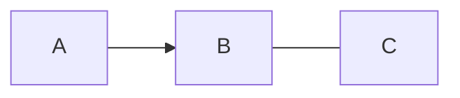
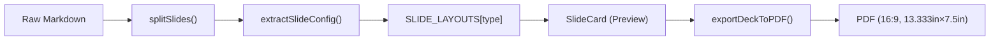
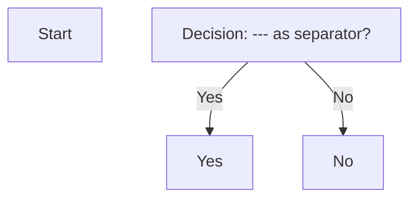

# Skill: Slide Deck Markdown Authoring

This is the airtight authoring contract for generating DevHub slide-deck markdown. Follow these rules precisely so your deck renders as intended.

---

## Slide Separator

**`---` alone on its own line is the slide separator.** Each separator marks the end of one slide and the start of the next.

**Fence-aware:** The split is safe inside code and mermaid blocks. A `---`-looking line inside a ` ``` ` fenced block does NOT split the slide — it is treated as literal content. So you can safely use `---` in mermaid diagrams, code examples, or other fenced blocks without fracturing your deck.

```md
---
```yaml
type: content
title: "Slide 1"
```
This is slide 1 body.

---
```yaml
type: content
title: "Slide 2"
```
This is slide 2 body.

---
```yaml
type: content
```

The --- line inside the mermaid block is literal content; it does NOT split the slide.
```

---

## Per-Slide Config (YAML Fence)

**Config goes in a ` ```yaml ... ``` ` fenced block at the start of each slide, NOT in `---`-delimited frontmatter.**

**Why not frontmatter?** Frontmatter uses `---` as a fence. If you put the slide separator AFTER a `---`-fenced frontmatter, the parser would see three `---` markers: the opening one, the closing one, and the separator. The fence-aware split would ignore the `---` inside the frontmatter but treat the closing `---` as a separator, breaking your slide. A fenced code block has no such collision — `---` markers for the fence and the separator stay cleanly distinct.

**Structure:**
```md
---
```yaml
type: content
title: "Your Title"
other-field: value
```
Your slide body goes here, after the closing ```.
```

The yaml block is optional. If there is no yaml block, the entire slide chunk defaults to `type: content` with the whole chunk as body markdown.

---

## Deck Title & Metadata

**There is no separate deck-level frontmatter.** The first slide in your deck MUST have `type: title` and carries the deck's title, subtitle, author, and date:

```yaml
type: title
title: "Deck Title"
subtitle: "Optional subtitle"
author: "Author Name"
date: "2026-07-14"
```

These four fields are used ONLY on the `title` slide; they are ignored on all other slide types.

---

## Deck-Level Config (`type: deck`)

**A `type: deck` yaml-fence block sets deck-wide defaults — the same `style`/`footer` fields every slide already uses.** It is config, not a slide: it is never rendered as a page. Put it anywhere in the deck (conventionally first); it's excluded from the slide sequence regardless of position.

```yaml
type: deck
style:
  background:
    color: "#0f172a"
  body:
    color: "#e2e8f0"
    fontSize: "1em"
footer:
  show: true
  left: "DevHub"
  pageNumber: false
```

Recognized fields (both optional): `style` (same 3-level schema and guardrails as per-slide `style` — see Style Value Guardrails below) and `footer` (same flat 2-level schema as per-slide `footer`). Anything else on a `type: deck` block (a title, body text, etc.) is ignored.

**Why not `---` frontmatter?** Same reason per-slide config isn't frontmatter — see "Per-Slide Config" above. `type: deck` reuses the exact same yaml-fence mechanism, so there's one convention for both document-level and slide-level config, not two.

**Merge semantics — deck = default, slide = override, one consistent model:**

Every slide's `style`/`footer` field-merges *over* the deck's `style`/`footer`, per category/property:

```
built-in default → type: deck block → individual slide
```

A slide overriding `style.title.color` keeps the deck's `style.background.color` and any other `style.title.*`/`style.body.*` the deck set. Same for `footer`: a slide overriding `footer.right` keeps the deck's `footer.left`/`footer.center`/`footer.pageNumber`.

**Multiple `type: deck` blocks:** the first is used; the rest are ignored and — like the first — never rendered as slides.

**No `type: deck` block:** every slide falls back to the built-in defaults (empty style, footer visible with no text, page numbers off).

---

## Slide Types & Schema

All 5 v1 slide types. Each row shows the type name, which yaml fields it uses, and whether the body markdown is rendered.

| Type | YAML Slots | Body Markdown |
|------|-----------|---------------|
| `title` | `title`, `subtitle`, `author`, `date` | **unused** — body ignored |
| `section` | `title` | **unused** — body ignored |
| `content` | `title` (optional) | **full markdown rendered** — lists, tables, images, mermaid all work |
| `two-column` | `title` (optional), `columns: [left, right]` (exactly 2 markdown strings) | **unused** — body ignored |
| `image-focus` | `title` (optional), `image` (URL), `caption` (optional) | **optional side-text** — rendered as body markdown next to the image |

### Type Details

#### `title`
Title slide for the deck. Use only once, as the first slide.

**Example:**
```yaml
type: title
title: "Q3 Review"
subtitle: "Architecture & Roadmap"
author: "Aayush Gour"
date: "2026-07-14"
```

#### `section`
Divider/section header. Large centered title, typically with a distinct background color via `style`. Body ignored.

**Example:**
```yaml
type: section
title: "Pipeline Overview"
style:
  background:
    color: "#1e293b"
  title:
    color: "#ffffff"
```

#### `content`
General-purpose slide. Optional title + full markdown body (lists, tables, images, mermaid, code blocks all work). The fallback type if you omit `type` entirely.

**Example:**
```yaml
type: content
title: "Releases This Quarter"
```
- v0.0.8: zoom/pan support
- v0.0.9: edge labels
- v0.0.10: layout fixes

#### `two-column`
Side-by-side layout. Two markdown strings in `columns: [left, right]` — exactly 2 entries. Body markdown is ignored.

**Important:** `columns` MUST be a list with exactly 2 items. If you provide more or fewer, the deck will pad or truncate it to 2 (missing columns render empty).

**Example:**
```yaml
type: two-column
title: "Build vs Buy"
columns:
  - "### Build\n- Full control\n- Owns roadmap"
  - "### Buy\n- Faster to market\n- Vendor lock-in risk"
```

#### `image-focus`
Large image as the slide anchor. Optional title, required URL, optional caption, and optional side-text body.

**Example:**
```yaml
type: image-focus
title: "New Layout"
image: "https://example.com/screenshot.png"
caption: "Responsive 16:9 cards"
```
Optional side text explaining the image appears here.

---

## Universal Fields

These three fields work on ANY slide type. They are applied at the slide wrapper level.

### `notes`
Speaker notes. Shown in the editor preview, but **completely stripped from PDF export**. Use for reminders, talking points, etc.

```yaml
notes: "Mention the Q2 performance improvements here."
```

### `footer`
Per-slide footer override. Flat, 2 levels deep:

```yaml
footer:
  show: true
  left: "Company Name"
  center: "Q3 2026"
  right: "Internal"
  pageNumber: true
```

**Page numbers are OFF by default.** `pageNumber` (like every other footer field) inherits from the deck-level footer (see "Deck-Level Config" above) when a slide omits it, and the built-in default is `false`. Turn page numbers on for the whole deck via a `type: deck` block's `footer.pageNumber: true`, or per-slide via that slide's own `footer.pageNumber: true`. There is no separate always-on page-number indicator — the number only ever appears as part of the footer, so `footer.show: false` also hides the number.

**Merge semantics:** Any field you omit inherits the deck-level footer setting for that field (the `type: deck` block's `footer`, or the built-in default if the deck has none). So you can override just one field:

```yaml
footer:
  right: "Public"
```

This slide keeps `left`/`center`/`pageNumber` from the deck footer but shows "Public" on the right.

**Common override:** Hide the footer on the title slide:
```yaml
footer:
  show: false
```

### `style`
Per-slide visual styling. Nested exactly 3 levels: `style.<category>.<property>`.

Three fixed categories:
- `background` — `color`, `image`
- `title` — `color`, `fontSize`, `align`
- `body` — `color`, `fontSize`

Unknown categories or properties are silently ignored; the rest of `style` still applies.

**Example — dark slide with large white title (note `em`, not `px`):**
```yaml
style:
  background:
    color: "#0f172a"
  title:
    color: "#ffffff"
    fontSize: "3em"
    align: "center"
  body:
    color: "#e2e8f0"
    fontSize: "1.1em"
```

---

## Style Value Guardrails (HARD RULES)

These are not suggestions — they are strict rules. A value that doesn't match its rule is **silently ignored** and the deck/layout default applies instead. So stay inside the rules to get what you intend.

### `color` (background.color, title.color, body.color)
**Must be hex or rgb/rgba:**
- Hex: `#fff`, `#ffffff` (3 or 6 digits)
- RGB: `rgb(255, 0, 0)`, `rgb(255, 0, 0, 0.8)`
- RGBA: `rgba(255, 0, 0, 0.5)`

**Invalid examples (silently ignored):**
- `red`, `blue`, `hsl(...)`, `var(--color)` — all wrong format
- The fallback (deck or layout default) applies instead

### `fontSize` (title.fontSize, body.fontSize)
**Prefer `em` — use RELATIVE units, not `px`.**

> **Why this matters:** slides render at two very different pixel sizes — the small in-app
> preview card and the full 13.333in export page. A slide's base font-size is derived from
> the slide's own width, and everything scales off it, so the slide looks proportionally
> identical at both sizes. `em` is relative to that scaled base, so `1.5em` is always "1.5×
> the slide's text" at any size. **`px` is a fixed absolute size** — it does NOT scale with
> the slide, so a `px` value that looks right in the preview will look wrong (too small) in
> the export. **`rem` also does NOT scale** — it is tied to the app's root font-size, not the
> slide. So: **use `em`.**

**Must be a number + unit, and must resolve within an 8–120px equivalent range** (a sanity
clamp; out-of-range values are ignored and the default applies).

- **Recommended:** `em` — e.g. `1.5em`, `2.5em`, `0.9em`. Scales with the slide. `1em` = the
  slide's base body size; `2em` = twice that.
- Accepted but discouraged: `px`, `rem`, `pt` — validated the same way, but they do **not**
  scale with the slide box, so avoid them.

**Conversion basis for the 8–120px range check:** `px` as-is; `em`/`rem` at 16px base (1em =
16px); `pt` at 96/72 (1pt = 1.333px).

**Examples:**
- `1.5em` → within range ✓ (recommended — scales with the slide)
- `2.5em` → within range ✓
- `0.5em` → 8px equiv ✓ (at the minimum)
- `12px` → valid but discouraged (fixed size, won't scale)
- `200px` / `8em` → too large, ignored, default applies
- `huge`, `large`, `5` (no unit) → invalid format, ignored

### `align` (title.align only)
**Must be one of: `left`, `center`, `right`**

Any other value is ignored.

### `background.image`
**Must be an `http://` or `https://` URL.**

Invalid schemes are **blocked for security:**
- `javascript:` — blocked
- `data:` — blocked
- Relative paths — must be full URLs

**Example:**
```yaml
style:
  background:
    image: "https://example.com/bg.jpg"
```

---

## Overflow Handling

Slides have a **fixed size** (13.333in × 7.5in in export). Content that is too long to fit will shrink to fit rather than spill onto the next page.

**Do NOT rely on scale-to-fit as a layout strategy.** It is a safety net only. **Keep each slide's content short enough to fit the box.**

How it works:
1. After your slide renders, its content height is measured.
2. If it overflows the box, the entire slide (text, spacing, images) shrinks proportionally. The scale floor is 0.6 — if scale goes below 0.6, shrinking stops and remaining overflow is clipped at the box bounds.
3. In the preview editor, a small "content overflows" badge appears on overflowed slides (a signal to trim your source). The badge is **never shown in the PDF export**.

**Best practice:** If you see the overflow badge, split the content into more slides or remove details. Don't expect scale-to-fit to fix it.

---

## Fallback Behavior

The decoder is forgiving. Every error degrades gracefully:

| Condition | Fallback |
|-----------|----------|
| No yaml fence in the chunk | `type: content`, entire chunk is body |
| `type` missing or unrecognized | `type: content` |
| `columns` not exactly 2 items (two-column type) | Padded or truncated to 2; missing column renders empty |
| Malformed yaml in the fence | Chunk becomes `type: content`; the raw fence text is shown in the body (visible, not silently dropped) so you know something went wrong |
| Unknown `style` category/property | That single key is ignored; rest of `style` applies |
| `style` value fails its guardrail (bad color, fontSize out of range, etc.) | That single value is ignored; rest of `style` applies |
| Unknown `footer` key | Ignored; rest of `footer` applies |
| `style` or `footer` not an object | Entire field is ignored; slide uses deck defaults |
| A `type: deck` chunk's `style`/`footer` fails validation | Same per-key guardrail dropping as a slide's own `style`/`footer`; the deck falls back to built-in defaults for the dropped keys |
| Multiple `type: deck` blocks | First is used; the rest are ignored (and, like the first, never rendered as slides) |

**No fallback ever throws or removes a slide from the deck.** Every chunk always renders as some slide.

---

## Worked Full-Deck Example

A complete, valid deck exercising all 5 types + universal fields + common body content:

````md
---
```yaml
type: deck
footer:
  show: true
  left: "DevHub"
  pageNumber: true
```

---
```yaml
type: title
title: "DevHub Architecture"
subtitle: "Q3 Review"
author: "Aayush Gour"
date: "2026-07-14"
footer:
  show: false
style:
  background:
    color: "#0f172a"
  title:
    color: "#ffffff"
    fontSize: "2.75em"
    align: "center"
```

---
```yaml
type: section
title: "Pipeline Overview"
style:
  background:
    color: "#1e293b"
  title:
    color: "#ffffff"
    fontSize: "2.25em"
```

---
```yaml
type: content
title: "What Ships This Quarter"
```
- Slide Deck export (landscape PDF, 16:9 slides)
- Mermaid theming pass (dark mode support)
- Graph mode edge labels (connector names)

---
```yaml
type: content
title: "Release Comparison"
footer:
  right: "Internal use only"
```
| Version | Date | Feature |
|---|---|---|
| 0.0.8 | 2026-05 | Zoom & pan |
| 0.0.9 | 2026-06 | Edge labels |
| 0.0.10 | 2026-07 | Layout fixes |

---
```yaml
type: two-column
title: "Build vs Buy"
columns:
  - "### Build\n\n- Full control\n- Slower go-live\n- Owns the roadmap"
  - "### Buy\n\n- Faster time-to-market\n- Vendor lock-in\n- Less customization"
```

---
```yaml
type: image-focus
title: "New Preview Layout"
image: "https://example.com/screenshots/preview.png"
caption: "Responsive landscape cards, one per slide"
style:
  title:
    fontSize: "2em"
```
The preview pane now shows a paginated stack of landscape cards, each 16:9 aspect ratio, with live markdown rendering and mermaid support.

---
```yaml
type: content
title: "Architecture Pipeline"
notes: "Remind the team that this reuses the same mermaid pipeline as the continuous-mode docs."
```


---
```yaml
type: content
title: "Image in Content Slide"
```
Here is an inline image:


And a list below it:
- Point 1
- Point 2
- Point 3

---
```yaml
type: content
notes: "This slide demonstrates style overrides at the slide level."
style:
  background:
    color: "#f8fafc"
  title:
    color: "#0f172a"
    fontSize: "1.75em"
  body:
    color: "#1e293b"
    fontSize: "1em"
```
This slide has custom colors and font sizes via the `style` field. The background is light, the title and body text are dark, and the font sizes are smaller than the deck default.

---
```yaml
type: content
title: "Mermaid with --- in it"
```

The `---` inside the mermaid fence is literal content, not a slide separator, because the parser tracks fence nesting.

````

**Notes on this example:**
- **Deck-level config** — a `type: deck` opening block turns on the footer and page numbers for the whole deck (`footer.show: true`, `footer.pageNumber: true`, `footer.left: "DevHub"`) — every slide in the example inherits that unless it sets its own `footer`.
- **Lists and tables** — plain markdown in a `content` slide's body. No special handling needed.
- **Images** — `` inline in `content` slides, or the dedicated `image` slot in `image-focus` slides.
- **Mermaid** — ` ```mermaid ... ``` ` fenced blocks inside `content` slide body. The fence-aware split means `---` lines inside mermaid blocks are safe.
- **Footer override** — the "Release Comparison" slide overrides only `right`, inheriting other footer fields from the deck.
- **Style override** — several slides show `style` at different nesting levels.
- **Notes** — visible in the editor preview, completely stripped from PDF export.
- **Fallback** — any intentional omission (e.g., no `title` on a slide) falls back gracefully.

---

## Author Checklist

Before handing off your deck:

- [ ] First slide has `type: title` with deck title/subtitle/author/date
- [ ] If the deck needs shared styling/footer defaults, a `type: deck` block is present (anywhere, conventionally first) with only `style`/`footer` set
- [ ] Page numbers are intentionally on or off — remember the default is OFF; set `footer.pageNumber: true` (deck-level or per-slide) if you want them
- [ ] All `type` values are one of: `title`, `section`, `content`, `two-column`, `image-focus`
- [ ] All yaml blocks are fenced with ` ```yaml ... ``` `, not `---`-delimited frontmatter
- [ ] All slide separators are `---` alone on their own line (not indented, no extra text)
- [ ] `two-column` slides have exactly 2 items in `columns` list
- [ ] `image-focus` slides have a valid `https://` or `http://` URL in `image`
- [ ] All `style` colors are hex or rgb/rgba format
- [ ] All `style` fontSize values use `em` (relative — scales with the slide), not `px`/`rem`, and resolve within the 8–120px-equivalent range
- [ ] All `style` align values are `left`, `center`, or `right`
- [ ] All `style` background.image URLs start with `http://` or `https://`
- [ ] Content on each slide is short enough to fit in the slide box (watch for overflow badges in preview)
- [ ] Markdown in body, columns, and caption slots uses standard syntax (lists, tables, code, mermaid all work)

---

## Questions?

If a value doesn't match its guardrail, it is silently ignored and the deck default applies. Always verify your deck in the DevHub preview before exporting. The preview shows the same rendering as the PDF.
