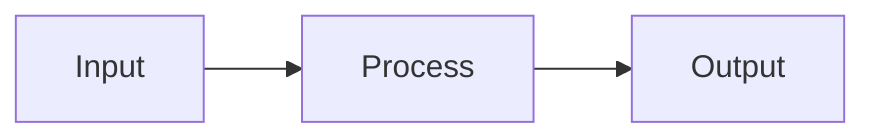

---
```yaml
type: deck
footer:
  show: true
  left: "Your Company"
  pageNumber: true
```

---
```yaml
type: title
title: "Project Title"
subtitle: "Your subtitle here"
author: "Your Name"
date: "2026-07-14"
footer:
  show: false
style:
  background:
    color: "#0f172a"
  title:
    color: "#ffffff"
    fontSize: "2.75em"
    align: "center"
```

---
```yaml
type: section
title: "Section 1: Overview"
style:
  background:
    color: "#1e293b"
  title:
    color: "#ffffff"
    fontSize: "2.25em"
```

---
```yaml
type: content
title: "Key Points"
```
- First point goes here
- Second point goes here
- Third point goes here

---
```yaml
type: content
title: "Data Table"
footer:
  right: "Internal Use"
```
| Column 1 | Column 2 | Column 3 |
|---|---|---|
| Row 1A | Row 1B | Row 1C |
| Row 2A | Row 2B | Row 2C |
| Row 3A | Row 3B | Row 3C |

---
```yaml
type: two-column
title: "Side-by-Side Comparison"
columns:
  - "### Left Column\n\n- Item 1\n- Item 2\n- Item 3"
  - "### Right Column\n\n- Feature A\n- Feature B\n- Feature C"
```

---
```yaml
type: image-focus
title: "Image Slide"
image: "https://via.placeholder.com/1280x720?text=Your+Image+Here"
caption: "A descriptive caption for the image"
```
Optional side text can appear next to the image to provide additional context or explanation.

---
```yaml
type: content
title: "Code & Diagrams"
```
Here is a mermaid diagram:



---
```yaml
type: content
```
This slide has no title and no special styling — just body content.

Plain markdown works:
- Lists
- Tables
- **Bold** and *italic*
- Links and images
