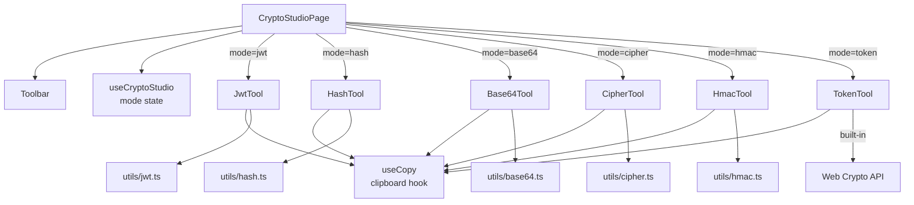
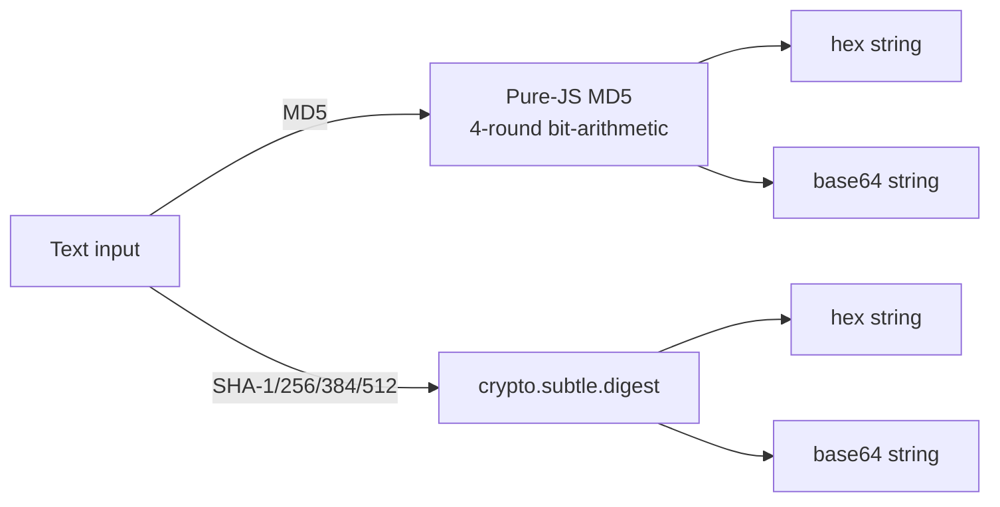
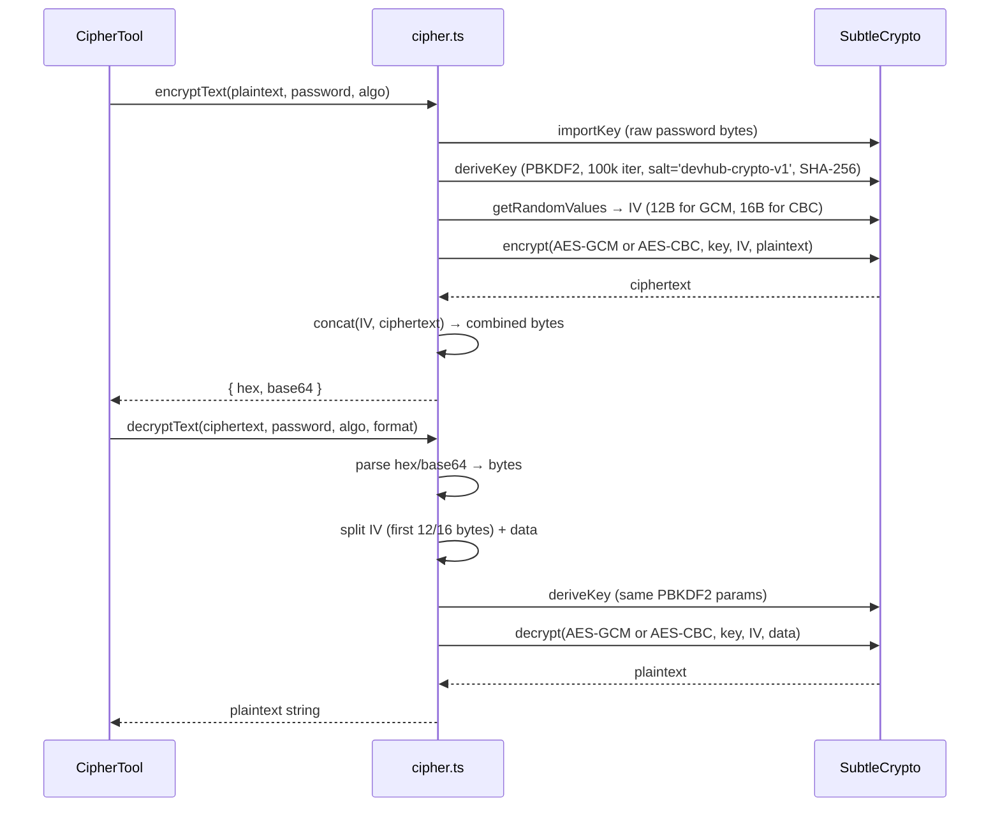
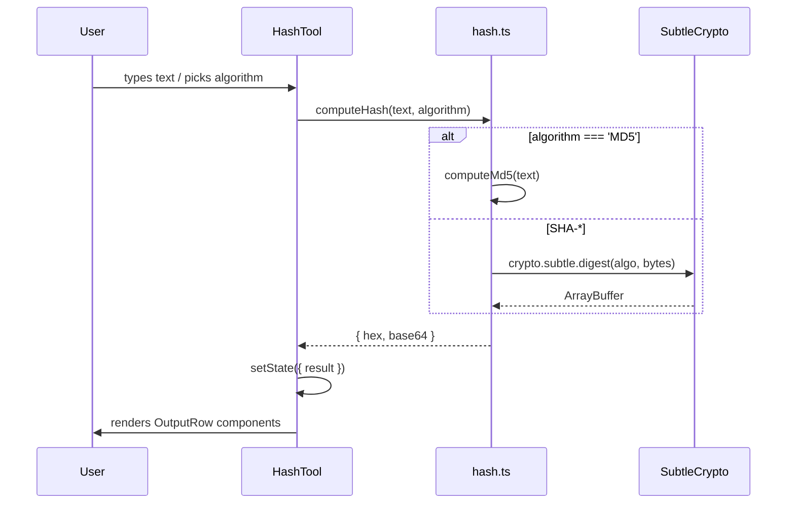

# Crypto Studio

## What It Is

Crypto Studio is a browser-based cryptography workbench. It bundles six tools — JWT decode/sign, hashing (MD5 → SHA-512), HMAC, AES encryption/decryption, Base64 encode/decode, and secure token generation — all running client-side using the Web Crypto API and pure-JS implementations. Nothing leaves the browser.

---

## File Tree

```
src/features/crypto-studio/
├── index.tsx                    (27)   — Page root, mode dispatch
├── components/
│   ├── Toolbar.tsx              (34)   — Mode switcher buttons
│   ├── Base64Tool.tsx          (147)   — Encode / decode / file upload
│   ├── HashTool.tsx            (125)   — MD5 + SHA-* hashing
│   ├── HmacTool.tsx            (103)   — HMAC-SHA signing
│   ├── CipherTool.tsx          (232)   — AES-GCM/CBC encrypt-decrypt
│   ├── JwtTool.tsx             (265)   — JWT decode + HS* sign
│   └── TokenTool.tsx           (129)   — Secure random token generator
├── hooks/
│   ├── useCopy.ts               (15)   — Clipboard + "Copied" feedback
│   └── useCryptoStudio.ts        (8)   — Active mode state
└── utils/
    ├── constants.ts             (42)   — Types + option arrays
    ├── base64.ts                (34)   — Encode / decode / file-to-base64
    ├── hash.ts                  (96)   — MD5 (JS) + SHA via SubtleCrypto
    ├── hmac.ts                  (20)   — HMAC via SubtleCrypto
    ├── cipher.ts               (103)   — AES via SubtleCrypto + PBKDF2
    └── jwt.ts                   (45)   — Decode (manual) + encode (jose)
```

---

## Architecture



---

## Modes

| Mode ID | Component | What It Does |
|---------|-----------|-------------|
| `jwt` | `JwtTool` | Decode any JWT (no key needed); sign new JWTs with HS256/384/512 |
| `hash` | `HashTool` | Hash text with MD5, SHA-1, SHA-256, SHA-384, SHA-512. Output: hex + base64 |
| `base64` | `Base64Tool` | Encode text or files to Base64; decode back. URL-safe mode toggle |
| `cipher` | `CipherTool` | Encrypt/decrypt with AES-128-GCM, AES-256-GCM, AES-256-CBC using PBKDF2 |
| `hmac` | `HmacTool` | Compute HMAC-SHA256/384/512 for message + secret |
| `token` | `TokenTool` | Generate cryptographically secure random tokens: hex, base64, alphanumeric, UUID v4 |

---

## Components

### `Toolbar`

Renders a button row with one button per mode. Active mode gets `bg-accent text-accent-text`; others get muted text with `hover:bg-surface-hover`. Calls `onModeChange(id)` on click.

### `Base64Tool`

**State:** `mode` (encode/decode), `urlSafe` (boolean), `input`, `error`.

**Layout:** Two-column — input textarea on left, swap button centre, output + copy on right.

Key features:
- Live encoding (no submit button)
- **File upload:** Hidden `<input type="file">` triggered via ref. Reads file as Data URL, extracts the base64 part after the comma.
- **Swap:** Flips mode, moves output to input.
- URL-safe mode replaces `+` → `-`, `/` → `_`, strips `=` padding.

### `HashTool`

**State:** `input`, `algorithm`, `result: { hex, base64 } | null`.

`useEffect` watches `input + algorithm` → calls `computeHash()` async → updates `result`. Two `OutputRow` sub-components show hex and base64 outputs with individual copy buttons.

### `HmacTool`

**State:** `message`, `secret`, `algorithm`, `result` (hex string).

Similar effect pattern. Clears result if either message or secret is empty. Shows byte/bit size next to output.

### `CipherTool`

**State:** `algorithm`, `cipherMode` (encrypt/decrypt), `password`, `input`, `inputFormat` (hex/base64 for decrypt), `encResult`, `decResult`, `error`, `loading`.

- **Encrypt:** Calls `encryptText(input, password, algorithm)` → returns `{ hex, base64 }`. Shows both outputs plus a note that IV is prepended.
- **Decrypt:** Calls `decryptText(input, password, algorithm, inputFormat)` → returns plaintext.
- **Generate password:** Random 32-byte hex via `generatePassword()`.
- A `Process` button triggers the operation (not live — cipher ops are expensive).

### `JwtTool`

Two sub-components controlled by a `subMode` toggle:

**`JwtDecode`**
- Parses the token by splitting on `.` and base64url-decoding each part.
- Shows header + payload as formatted JSON in `JsonBlock` sub-components.
- Displays expiry badge (green "valid" / red "expired") if `exp` claim is present.

**`JwtEncode`**
- Takes a JSON payload textarea, secret input, and algorithm select.
- Calls `encodeToken(payload, secret, algorithm)` via the `jose` library (HS256/384/512).
- Shows signed JWT with copy button.

### `TokenTool`

**State:** `format` (hex/base64/alphanumeric/uuid), `bits` (128/256/512), `output`.

All randomness comes from `crypto.getRandomValues()`. UUID v4 manually sets version bits (4) and variant bits. alphanumeric format indexes into a fixed alphabet string using random bytes.

---

## Hooks

### `useCopy`

```typescript
function useCopy(): {
  copiedKey: string | null
  copy: (text: string, key?: string) => void
}
```

Writes to `navigator.clipboard.writeText`. Sets `copiedKey` to the provided key (or `'default'`), then auto-clears after 1500ms. Multiple tools use this to show "Copied ✓" feedback without implementing it themselves.

### `useCryptoStudio`

Trivial: `useState<CryptoMode>('jwt')`. Returns `{ mode, setMode }`.

---

## Utils

### `base64.ts`

| Function | Inputs | Returns |
|----------|--------|---------|
| `encodeBase64(text, urlSafe?)` | string, bool | base64 string |
| `decodeBase64(text, urlSafe?)` | string, bool | decoded string |
| `encodeFileBase64(file)` | File | `Promise<string>` (data URL → base64 extraction) |

Uses `TextEncoder → btoa()` for encode; `atob() → TextDecoder` for decode. Padding is automatically added/removed.

### `hash.ts`



MD5 is implemented from scratch (no dependency) because `crypto.subtle` doesn't support MD5. The implementation includes `safeAdd`, `rol`, `ff/gg/hh/ii` auxiliary functions, and `md5Core`.

### `hmac.ts`

```typescript
computeHmac(message, secret, algorithm) → Promise<string>  // hex
```

Uses `crypto.subtle.importKey()` → `crypto.subtle.sign()`. Three lines of code.

### `cipher.ts`



PBKDF2 parameters: salt = `"devhub-crypto-v1"`, 100,000 iterations, SHA-256, key usage `['encrypt','decrypt']`.

Key size: AES-128-GCM → 128 bits; AES-256-GCM and AES-256-CBC → 256 bits.

### `jwt.ts`

**Decode (`decodeToken`)**: Manual — splits on `.`, base64url-decodes, JSON-parses header/payload, reads `exp` claim, compares to `Date.now() / 1000`.

**Encode (`encodeToken`)**: Uses the `jose` library (`SignJWT`). Parses provided JSON string, signs with `new SignJWT(payload).setProtectedHeader({alg}).sign(secretKey)`.

---

## Data Flow (single tool example: Hash)



---

## Constants (`constants.ts`)

All mode/algorithm arrays live here as typed constants. This is the single source of truth for what the toolbar shows and what `<select>` options appear in each tool.

```typescript
type CryptoMode     = 'jwt' | 'hash' | 'base64' | 'cipher' | 'hmac' | 'token'
type HashAlgorithm  = 'MD5' | 'SHA-1' | 'SHA-256' | 'SHA-384' | 'SHA-512'
type HmacAlgorithm  = 'SHA-256' | 'SHA-384' | 'SHA-512'
type CipherAlgorithm = 'AES-128-GCM' | 'AES-256-GCM' | 'AES-256-CBC'
type TokenFormat    = 'hex' | 'base64' | 'alphanumeric' | 'uuid'
type TokenBits      = 128 | 256 | 512
type JwtAlgorithm   = 'HS256' | 'HS384' | 'HS512'
```

---

## Shared Patterns

| Pattern | Location | Detail |
|---------|----------|--------|
| Reusable class constants | Each tool | `TEXTAREA_CLS`, `INPUT_CLS`, `SELECT_CLS`, `OUTPUT_CLS` — avoids repeating Tailwind strings |
| `useCopy` for clipboard | All tools | Single hook, single timeout, single "Copied" state |
| `useEffect` for live compute | Hash, HMAC | Recompute on dep change; no submit button |
| Submit button for expensive ops | Cipher, JWT encode | AES/PBKDF2 is fast but UX intent is explicit |
| No inline styles | All | CLAUDE.md requirement — 100% Tailwind |

---

## How to Contribute

### Add a new mode

1. Add the mode ID to `CryptoMode` in `constants.ts`. Add a `{ id, label }` entry to `CRYPTO_MODES`.
2. Create a component in `components/`. Use `useCopy` for clipboard.
3. Add a utility function in `utils/` if the crypto logic is non-trivial.
4. Add a `case` in `index.tsx`'s conditional render.

### Add a hash algorithm

1. Add to `HashAlgorithm` union and `HASH_ALGORITHMS` array in `constants.ts`.
2. Add a `case` in `computeHash()` in `hash.ts`. Web Crypto supports SHA-256/384/512 natively. MD5-style custom implementations go in `hash.ts`.

### Add a cipher algorithm

1. Add to `CipherAlgorithm` and `CIPHER_ALGORITHMS` in `constants.ts`. Update `CIPHER_KEY_BITS` map.
2. Update `algoName()` and `ivLength()` in `cipher.ts`. Web Crypto supports AES-GCM and AES-CBC natively.
