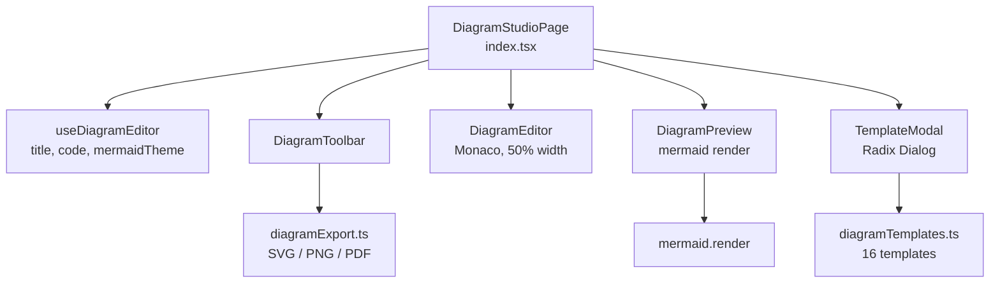
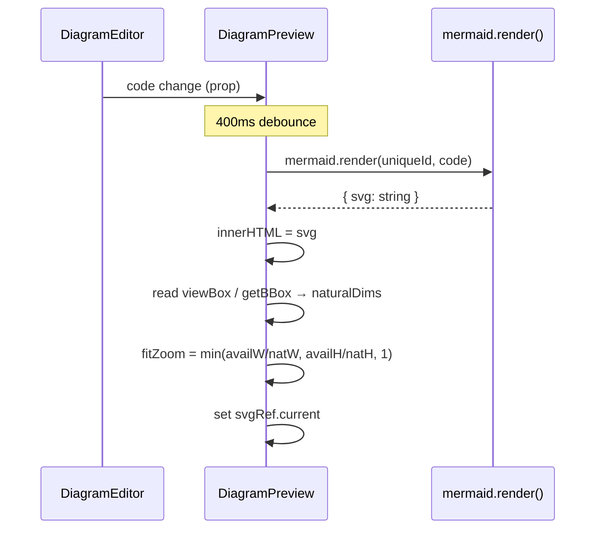
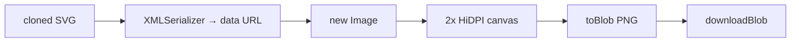
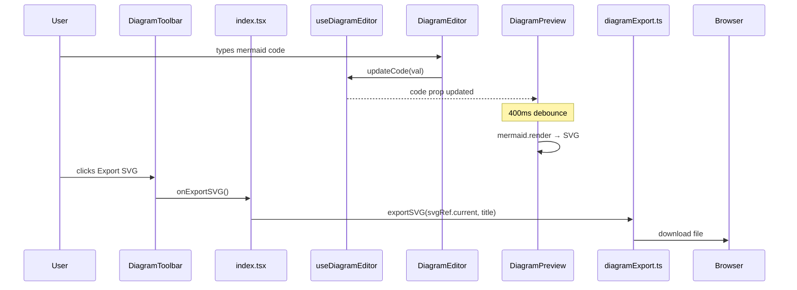

# Diagram Studio

## What It Is

Diagram Studio is a mermaid diagram editor with Monaco code input, live rendered preview (with pan/zoom), a 16-template library, and SVG/PNG export. Write mermaid DSL, pick from six diagram types, and export production-ready diagrams.

---

## File Tree

```
src/features/diagram-studio/
├── index.tsx                    (40)   — Page root, layout, export wiring
├── hooks/
│   └── useDiagramEditor.ts      (16)   — title / code / theme state
├── components/
│   ├── DiagramEditor.tsx        (39)   — Monaco wrapper (mermaid DSL input)
│   ├── DiagramPreview.tsx      (193)   — Mermaid render, zoom, grid bg
│   ├── DiagramToolbar.tsx       (92)   — Title, theme select, export buttons
│   └── TemplateModal.tsx        (91)   — Radix Dialog template picker
└── utils/
    ├── diagramTemplates.ts     (672)   — 16 templates + type detection
    └── diagramExport.ts         (72)   — SVG / PNG / PDF export
```

---

## Architecture



---

## Supported Diagram Types

| Type | Mermaid keyword | Templates |
|------|----------------|-----------|
| Flowchart | `flowchart` / `graph` | 4 |
| Sequence | `sequenceDiagram` | 2 |
| ER Diagram | `erDiagram` | 2 |
| State | `stateDiagram` | 2 |
| Class | `classDiagram` | 2 |
| Gantt | `gantt` | 2 |

Type is auto-detected from the first non-whitespace line of the code by `detectDiagramType(code)` in `diagramTemplates.ts`. The detected type is shown as a badge in the toolbar.

---

## Components

### `DiagramStudioPage` (`index.tsx`)

Orchestrates all state from `useDiagramEditor`. Layout:
```
DiagramToolbar         [full width, h-11]
DiagramEditor          [50% fixed, left]
DiagramPreview         [flex-1, right]
TemplateModal          [overlay, conditional]
```

Export handlers check `svgRef.current` (set by `DiagramPreview`) before calling export functions.

### `DiagramEditor`

Monaco editor configured for mermaid DSL:
- Font: "JetBrains Mono", 13px, line-height 1.6
- Minimap off, word-wrap on, no folding, padding 16px
- Theme: `vs-dark` or `vs` based on app theme
- Language: plain text (mermaid has no Monaco grammar bundled)

### `DiagramPreview`

The most complex component. Manages the full render lifecycle:

**Render pipeline:**



A module-level `renderId` counter is incremented each render to guarantee unique IDs for `mermaid.render()`.

**Zoom system:**

| Action | Effect |
|--------|--------|
| Ctrl+scroll up | `zoom × 1.25` |
| Ctrl+scroll down | `zoom / 1.25` (min 0.05) |
| Zoom In button | `zoom × 1.25` |
| Zoom Out button | `zoom / 1.25` |
| Fit button | reset to `fitZoom`, reset pan |

Zoom is applied via SVG `width` attribute (`setAttribute('width', natW * zoom)`). This avoids CSS transform quirks with SVG export.

Pan is implemented via mouse drag: `onMouseDown` records `startX/Y`, `onMouseMove` computes delta, `onMouseUp` releases.

**Background:** 24px-spaced radial gradient dot grid (inline `style` — data-driven, not hardcoded).

**Error handling:** Strips HTML from mermaid's error strings. Shows red error box. Clears `svgRef` on failure so export is disabled.

### `DiagramToolbar`

```
[Title input] [Type badge?] [spacer] [Templates] | [Theme select] | [Export SVG] [Export PNG]
```

Title input: transparent bg, `font-semibold`, focus adds accent underline.

Theme select controls the mermaid rendering theme (`default | forest | dark | neutral`). Note: templates embed their own `%%{ init }%%` blocks that override this for branded colours.

### `TemplateModal`

Radix Dialog. Filter tabs across the top (All + 6 types). 2-column card grid below. Each card shows:
- Label + type badge
- Description
- First 3 lines of code (50% opacity)

Clicking a card calls `onSelect(template.code)` → updates the editor.

---

## Hook: `useDiagramEditor`

```typescript
export type MermaidTheme = 'default' | 'forest' | 'dark' | 'neutral'

{
  title: string
  setTitle: (s: string) => void
  code: string
  updateCode: (val: string | undefined) => void   // handles Monaco's undefined
  mermaidTheme: MermaidTheme
  setMermaidTheme: (t: MermaidTheme) => void
}
```

Initial `code` is the first template's code. No persistence — state resets on page reload.

---

## Template Library (`diagramTemplates.ts`)

16 templates across 6 types. Each template:

```typescript
interface DiagramTemplate {
  id: string          // e.g. 'flowchart-cicd'
  type: DiagramType
  label: string       // e.g. 'CI/CD Pipeline'
  description: string
  code: string        // full mermaid DSL with %%{ init }%% theme block
}
```

All templates include a custom theme via `%%{ init: { theme: 'base', themeVariables: {...} } }%%` for branded colours independent of the toolbar theme select.

Notable templates:

| ID | Type | What It Shows |
|----|------|---------------|
| `flowchart-cicd` | flowchart | CI/CD pipeline with test gate + review |
| `sequence-auth` | sequence | OAuth 2.0 four-party flow |
| `er-blog` | er | Blog schema (USER, POST, COMMENT, TAG) |
| `class-observer` | class | Observer design pattern |
| `state-amber-payment` | state | Payment lifecycle state machine |
| `gantt-roadmap` | gantt | Quarterly roadmap with overlapping phases |

---

## Export (`diagramExport.ts`)

All three functions receive `svgEl: SVGSVGElement` and `title: string`.

### `exportSVG`

1. Clone SVG
2. Set `xmlns="http://www.w3.org/2000/svg"`
3. `XMLSerializer` → string
4. Blob `image/svg+xml` → `downloadBlob`

### `exportPNG`



Canvas is scaled 2× for HiDPI screens. SVG is loaded as an `` from a data URL (not a blob URL) to avoid canvas taint from cross-origin content.

### `exportPDF`

Opens a blank `window.open`, writes SVG inside an HTML page with `@media print { max-width: 100% }` CSS, then calls `window.print()`. The window auto-closes after 1.5s. If the popup is blocked, alerts the user.

### `downloadBlob`

```typescript
function downloadBlob(blob: Blob, filename: string): void
// creates temp object URL → synthetic <a> click → revoke URL
```

---

## Data Flow



---

## Diagram Type Detection

```typescript
function detectDiagramType(code: string): DiagramType | null {
  const t = code.trimStart().toLowerCase()
  if (t.startsWith('flowchart') || t.startsWith('graph ')) return 'flowchart'
  if (t.startsWith('sequencediagram')) return 'sequence'
  if (t.startsWith('erdiagram')) return 'er'
  if (t.startsWith('statediagram')) return 'state'
  if (t.startsWith('classdiagram')) return 'class'
  if (t.startsWith('gantt')) return 'gantt'
  return null
}
```

This is a simple prefix match — no parsing. The result is shown as a badge in the toolbar and used to filter templates in the modal.

---

## How to Contribute

### Add a template

Add an entry to `TEMPLATES` in `diagramTemplates.ts`. Include a custom `%%{ init }%%` block for branded colours. The filter tabs and grid update automatically.

### Add a diagram type

1. Add to `DiagramType` union in `diagramTemplates.ts`.
2. Add a `DIAGRAM_TYPE_LABELS` entry.
3. Add a `startsWith` check in `detectDiagramType`.
4. Add filter tab in `TemplateModal.tsx`.

### Add an export format

Add a function to `diagramExport.ts` following the pattern of `exportSVG`. Wire a button in `DiagramToolbar` and a handler in `index.tsx`.

### Improve mermaid error messages

Edit the error-display block in `DiagramPreview.tsx`. The raw error from `mermaid.render()` is in `e.message`; HTML tags are stripped via regex before display.
