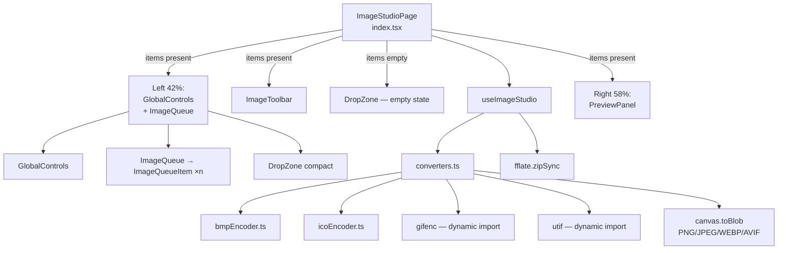
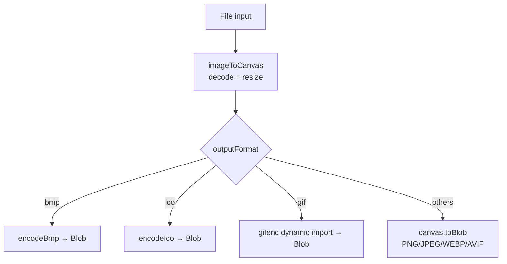
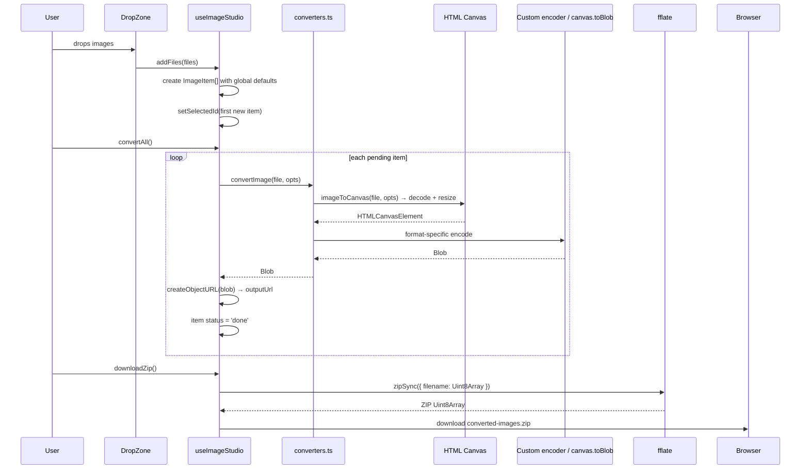

# Image Studio

## What It Is

Image Studio is a batch image converter. Drop one or more images, choose output format and quality per image (or globally), resize, and download individually or as a ZIP. Supports 7 output formats including BMP and ICO, which have custom hand-written encoders. TIFF input is decoded via `utif`. Everything runs client-side.

---

## File Tree

```
src/features/image-studio/
├── index.tsx                    (64)   — Root page, two-view layout
├── hooks/
│   └── useImageStudio.ts       (223)   — All state + conversion + zip logic
├── components/
│   ├── ImageToolbar.tsx         (67)   — Status bar + convert/zip/clear
│   ├── DropZone.tsx             (96)   — Full + compact upload zones
│   ├── GlobalControls.tsx       (97)   — Format/quality/resize global defaults
│   ├── ImageQueue.tsx           (41)   — Scrollable item list container
│   ├── ImageQueueItem.tsx      (157)   — Single item card
│   └── PreviewPanel.tsx        (104)   — Before/after image viewer
└── utils/
    ├── formatInfo.ts            (29)   — Format registry + MIME types
    ├── converters.ts           (118)   — Main conversion pipeline
    ├── bmpEncoder.ts            (49)   — BMP 24-bit encoder
    └── icoEncoder.ts            (39)   — ICO wrapper encoder
```

---

## Architecture



---

## Supported Formats

| Format | Output | Quality slider | Encoder |
|--------|--------|---------------|---------|
| PNG | `.png` | No | Native `canvas.toBlob` |
| JPEG | `.jpg` | Yes (1–100) | Native |
| WEBP | `.webp` | Yes | Native |
| AVIF | `.avif` | Yes | Native |
| GIF | `.gif` | No | `gifenc` (dynamic import) |
| BMP | `.bmp` | No | Custom `bmpEncoder.ts` |
| ICO | `.ico` | No | Custom `icoEncoder.ts` |

Input: PNG, JPG, JPEG, WEBP, GIF, BMP, SVG, ICO, AVIF, TIFF, TIF.

---

## State: `useImageStudio`

### Types

```typescript
type OutputFormat = 'png' | 'jpeg' | 'webp' | 'avif' | 'gif' | 'bmp' | 'ico'

interface ResizeOpts {
  width: string            // '' or pixel value as string
  height: string
  maintainAspectRatio: boolean
}

interface ImageItem {
  id: string               // 7-char random alphanumeric
  file: File
  originalUrl: string      // Object URL for before-preview
  outputFormat: OutputFormat
  quality: number          // 1–100
  resize: ResizeOpts
  status: 'pending' | 'converting' | 'done' | 'error'
  outputBlob: Blob | null
  outputUrl: string | null // Object URL for after-preview
  originalSize: number
  outputSize: number | null
  error: string | null
}

interface GlobalSettings {
  format: OutputFormat
  quality: number
  resize: ResizeOpts
}
```

### Key implementation details

**`syncItems(updater)`** — Atomically updates both `items` state AND `itemsRef.current`. This ensures `convertItem` (which runs async) always reads the latest items via ref, not a stale closure.

**Auto-reset on settings change** — `patchItemSettings(id, patch)`: if item was `'done'`, resets to `'pending'` and clears `outputBlob`/`outputUrl`. Forces re-conversion when format/quality/resize changes.

**`applyGlobalToAll()`** — Copies `global` to every item. Done items revert to `'pending'`.

**`convertAll()`** — Fires `convertItem` for all `'pending'` or `'error'` items concurrently (not awaited in a serial loop).

**`downloadZip()`** — Dynamic-imports `fflate`, collects blobs, maps to `Uint8Array` buffers, `zipSync({filename: buffer})`, downloads as `converted-images.zip`.

**Object URL lifecycle** — `revokeItem(item)` revokes both `originalUrl` and `outputUrl`. Called in `removeItem` and `clearAll`. Prevents memory leaks.

---

## Conversion Pipeline (`converters.ts`)



### `imageToCanvas(file, opts)`

**TIFF path:**
1. Dynamic import `utif`
2. `file.arrayBuffer()` → `utif.decode(buf)` → `utif.toRGBA8(decoded[0])` → canvas

**Standard path:**
1. `URL.createObjectURL(file)` → load `` via `onload`
2. Revoke URL after load (or on error)

**Resize via `computeDimensions(srcW, srcH, targetW, targetH, maintain)`:**

| Inputs | Behaviour |
|--------|-----------|
| No width/height | Return src dimensions |
| maintainAspectRatio + only W | `h = srcH × (W / srcW)` |
| maintainAspectRatio + only H | `w = srcW × (H / srcH)` |
| maintainAspectRatio + both | Use smallest ratio (letterbox fit) |
| Free resize | Use target values directly |

### `encodeBmp(canvas)` — BMP file format

Writes a 54-byte header + raw pixel data:

```
BITMAPFILEHEADER (14 bytes):
  BM signature + file size + reserved + pixel data offset (54)

BITMAPINFOHEADER (40 bytes):
  header size + width + height (negative = top-down) + 1 plane
  + 24 bpp + 0 compression + pixel array size + DPI

Pixel data:
  BGR byte order (not RGB), rows must be 4-byte aligned
  Canvas RGBA → drop alpha, reorder to BGR, pad rows
```

### `encodeIco(canvas)` — ICO file format

Wraps a PNG inside ICO container:

```
ICONDIR (6 bytes): reserved + type=1 + count=1
ICONDIRENTRY (16 bytes): width + height + 0 colors + reserved
  + planes + bpp + PNG data size + offset (22)
PNG data: canvas.toBlob('image/png') → ArrayBuffer
```

Dimension clamped to 256×256 (ICO spec maximum).

---

## Components

### `ImageToolbar`

Shows `doneCount/totalCount converted`. Three buttons when items exist:
- **Convert All** — accent bg, always enabled
- **Download ZIP** — disabled if `doneCount === 0`
- **Clear** — hover turns red

### `DropZone`

Two variants via `compact` prop:

**Full** (empty state): Centred card, dashed 2px border, drag icon, 9 format pills below. Switches icon on drag-over.

**Compact** (in queue footer): 40px-tall horizontal strip, "Add more images" text. Drag-and-drop still works.

Both filter files via `filterValid()` — checks MIME against `ACCEPTED_MIMES` or extension regex for TIFF.

### `GlobalControls`

Top-left panel. Two rows:
1. Format select + quality slider (conditional on `qualityCapable`)
2. Width/Height inputs + aspect-ratio lock + "Apply to all →" button

### `ImageQueueItem`

Item card. Shows:
- 9×9 thumbnail (cropped from `originalUrl`)
- Filename, original size, output size, delta % (emerald = saved, amber = larger)
- Format select + quality slider
- Status icon (spinner / check / alert)
- Convert and Download buttons

Click the card → select. `stopPropagation` on bottom row prevents deselection.

### `PreviewPanel`

Before/After toggle button group at top. Shows `originalUrl` (before) or `outputUrl` (after). Footer shows size, format label, and savings % (only when after-mode and smaller).

---

## Data Flow



---

## Format Registry (`formatInfo.ts`)

```typescript
const OUTPUT_FORMATS: Record<OutputFormat, FormatInfo> = {
  png:  { mime: 'image/png',       ext: 'png',  label: 'PNG',  qualityCapable: false },
  jpeg: { mime: 'image/jpeg',      ext: 'jpg',  label: 'JPEG', qualityCapable: true  },
  webp: { mime: 'image/webp',      ext: 'webp', label: 'WEBP', qualityCapable: true  },
  avif: { mime: 'image/avif',      ext: 'avif', label: 'AVIF', qualityCapable: true  },
  gif:  { mime: 'image/gif',       ext: 'gif',  label: 'GIF',  qualityCapable: false },
  bmp:  { mime: 'image/bmp',       ext: 'bmp',  label: 'BMP',  qualityCapable: false },
  ico:  { mime: 'image/x-icon',    ext: 'ico',  label: 'ICO',  qualityCapable: false },
}
```

`qualityCapable` controls whether the quality slider renders in `GlobalControls` and `ImageQueueItem`.

---

## How to Contribute

### Add an output format

1. Add to `OutputFormat` union in `formatInfo.ts`. Add the `FormatInfo` entry in `OUTPUT_FORMATS`. Add to `OUTPUT_FORMAT_LIST`.
2. Add a `case` in `convertImage()` in `converters.ts`. Either use `canvas.toBlob(mime, quality)` or write a custom encoder.
3. The format select in `GlobalControls` and `ImageQueueItem` picks it up automatically.

### Add an input format

1. Add the MIME type to `ACCEPTED_MIMES` in `formatInfo.ts`.
2. Add the extension to `ACCEPTED_EXTENSIONS`.
3. If the format needs custom decoding (like TIFF), add a branch in `imageToCanvas()` in `converters.ts`.
4. Update `DropZone.tsx`'s format pill labels.

### Change default quality

Edit `GlobalSettings` default in `useImageStudio.ts` (look for the `useState<GlobalSettings>` initialiser).

### Fix resize aspect-ratio logic

Edit `computeDimensions()` in `converters.ts`. The function is pure — easy to unit test independently.
