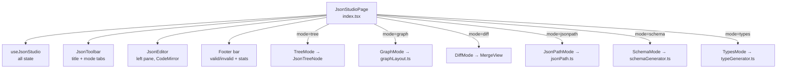
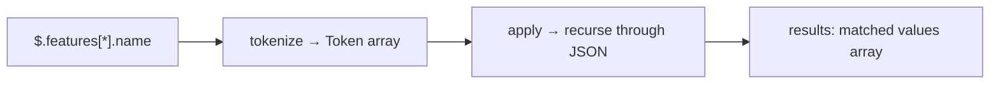
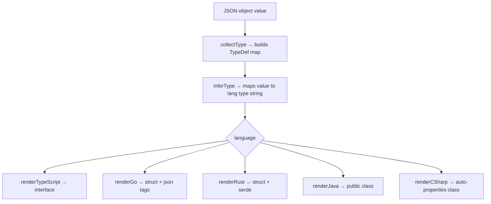
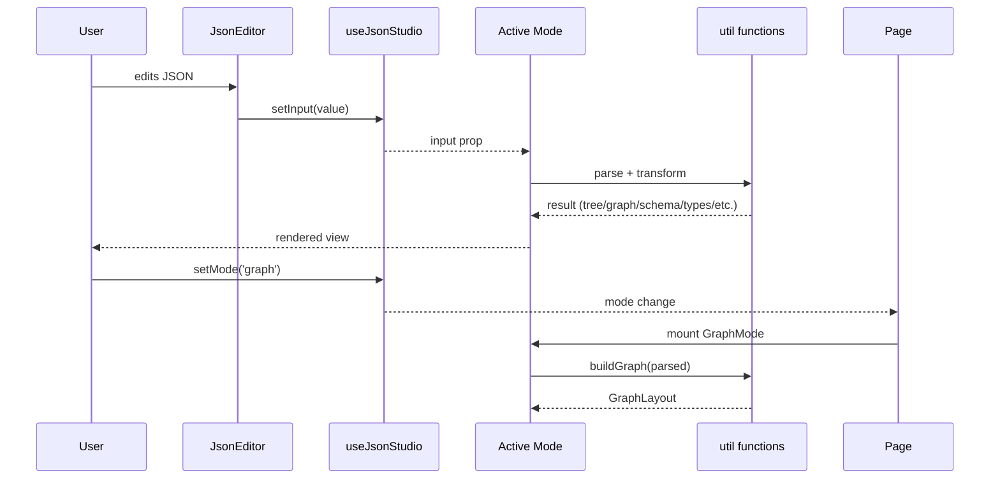

# JSON Studio

## What It Is

JSON Studio is a multi-mode JSON editor and analysis tool. It provides six views of any JSON document — a collapsible tree, an interactive node graph, a side-by-side diff, a JSONPath query engine, a JSON Schema generator, and a multi-language type definition generator (TypeScript, Go, Rust, Java, C#). All views share a single input editor powered by CodeMirror 6.

---

## File Tree

```
src/features/json-studio/
├── index.tsx                    (159)  — Root page, footer stats, layout
├── hooks/
│   └── useJsonStudio.ts          (52)  — All editor state
├── components/
│   ├── JsonEditor.tsx            (89)  — CodeMirror 6 editor wrapper
│   ├── JsonToolbar.tsx           (46)  — Title + mode switcher
│   ├── JsonTreeNode.tsx          (91)  — Recursive tree node
│   └── modes/
│       ├── TreeMode.tsx          (31)  — Collapsible tree view
│       ├── GraphMode.tsx        (276)  — Pan/zoom node graph
│       ├── DiffMode.tsx          (89)  — CodeMirror MergeView diff
│       ├── DiffMode.css          (11)  — Gutter + divider tweaks
│       ├── JsonPathMode.tsx      (95)  — JSONPath query + results
│       ├── SchemaMode.tsx        (55)  — JSON Schema generation
│       └── TypesMode.tsx         (87)  — Multi-language type gen
└── utils/
    ├── jsonPath.ts              (152)  — JSONPath parser + evaluator
    ├── schemaGenerator.ts        (46)  — JSON Schema (draft-07) builder
    ├── typeGenerator.ts         (153)  — TS/Go/Rust/Java/C# codegen
    └── graphLayout.ts           (158)  — Node-graph layout algorithm
```

---

## Architecture



---

## The Six Modes

| Mode | Component | What It Shows |
|------|-----------|---------------|
| `tree` | `TreeMode` + `JsonTreeNode` | Collapsible hierarchical tree |
| `graph` | `GraphMode` | Pan/zoom node graph of objects/arrays |
| `diff` | `DiffMode` | Side-by-side diff of two JSON documents |
| `jsonpath` | `JsonPathMode` | Query JSON with JSONPath expressions |
| `schema` | `SchemaMode` | Generated JSON Schema (draft-07) |
| `types` | `TypesMode` | Type definitions in TS, Go, Rust, Java, C# |

---

## State: `useJsonStudio`

```typescript
type JsonMode = 'tree' | 'graph' | 'diff' | 'jsonpath' | 'schema' | 'types'

// Returns:
{
  title: string              // Document title
  setTitle: fn
  mode: JsonMode             // Active view
  setMode: fn
  input: string              // Primary JSON (used by all modes except diff)
  setInput: fn
  diffLeft: string           // Left pane JSON for diff mode
  setDiffLeft: fn
  diffRight: string          // Right pane JSON for diff mode
  setDiffRight: fn
  jsonPathQuery: string      // Current JSONPath expression
  setJsonPathQuery: fn
  typeLang: TypeLang         // Language for type generation
  setTypeLang: fn
  rootName: string           // Root struct/class name for types mode
  setRootName: fn
}
```

Default values use two hardcoded DevHub config samples (v1.0.0 vs v2.0.0) so the tool is demonstrable immediately on load.

---

## Components

### `JsonToolbar`

Top bar with an editable title input (underline on focus) and mode tab buttons. Active mode gets raised background + full text colour.

### `JsonEditor`

CodeMirror 6 wrapper. Features: line numbers, fold gutter, bracket matching, autocompletion, JSON syntax highlighting. Detects dark/light from `settingsStore`.

Toolbar buttons (when `toolbar=true`):
- **Format** — prettify with indent 2
- **Minify** — compact single-line
- **Copy** — to clipboard
- **Clear** — empty editor

### `JsonTreeNode`

Recursive component. Each node renders as either:
- **Scalar** — key + coloured value on one line
- **Container** — key + expand arrow, count summary when collapsed, children when expanded

Default expansion depth < 2. Children render as `<JsonTreeNode depth={depth+1}>`. Indentation is `ml-4` per level with a left border for visual nesting.

Colour scheme via `text-json-*` Tailwind classes:
- Strings: green
- Numbers: blue
- Booleans: orange
- Null: muted red
- Keys: purple

### `GraphMode`

Interactive graph with pan (drag), zoom (buttons ±25%), and node count display.

**Layout algorithm** (in `graphLayout.ts`):
1. Recursively walk JSON value tree
2. Each object/array becomes a `GNode` with `rows` (inline scalars) and `childEdges` (nested objects/arrays)
3. `subtreeH(id)` calculates total height of a subtree (memoized)
4. `assignPos(id, level, yTop, yBot)` places nodes: x = `level × (NODE_WIDTH + SPACING_X)`, y = centre of allocation

Node dimensions: `NODE_WIDTH = 220px`, rows = `NODE_ROW_H = 24px` each, header = `NODE_HEADER_H = 34px`.

Edges render as SVG bezier curves between parent node right-edge and child node left-edge.

### `DiffMode`

Creates a single CodeMirror `MergeView` instance on mount. Each pane has a listener that syncs internal editor state back to `diffLeft`/`diffRight`. External state changes are dispatched in as character-range transactions (preserving cursor).

`DiffMode.css` widens the change gutter to 8px and adds a vertical border between panes.

### `JsonPathMode`

Five quick-example buttons + a text input for the query. Calls `evaluateJsonPath(root, path)` on every change, shows results as formatted JSON with a count badge.

### `SchemaMode` / `TypesMode`

Both: read-only CodeMirror editor on the right. Left side has controls (language selector for types, nothing for schema). Header has a copy button.

---

## Utils

### `jsonPath.ts` — JSONPath Parser + Evaluator

Implements a subset of the JSONPath spec. Tokenises the path string into a `Token[]` array, then recursively applies tokens to the JSON value.

**Supported syntax:**

| Syntax | Token type | Example |
|--------|-----------|---------|
| `$` | `root` | `$` |
| `.field` or `["field"]` | `key` | `$.config` |
| `[n]` or `[-n]` | `index` | `$.items[0]`, `$.items[-1]` |
| `.*` or `[*]` | `wildcard` | `$.items[*]` |
| `..field` or `..*` | `recursive` | `$..name` |



**`evaluateJsonPath(root, path)`** — public entry point. Returns `{ results, error }`.

### `schemaGenerator.ts` — JSON Schema (draft-07)

`generateSchema(value)` recursively infers schema:
- Scalars → `{ type }` constraints
- Arrays → `{ type: 'array', items: mergedSchema }`
- Objects → `{ type: 'object', properties: {...}, required: [...] }`

`mergeSchemas` handles mixed-type arrays: if all same type → single schema; if mixed → `{ oneOf: [...] }`.

`buildSchema` wraps with `$schema` and serialises.

### `typeGenerator.ts` — Multi-language Type Generator



**Key helper functions:**
- `toPascalCase` — converts `snake_case`/`kebab-case` to `PascalCase` for type names
- `toSnakeCase` — `PascalCase` → `snake_case` for Rust field names
- `boxJava` — maps primitives to boxed types (`int` → `Integer`)

Nested objects generate sub-types. A slot reservation pattern prevents infinite recursion on circular structures.

### `graphLayout.ts` — Graph Layout

Constants: `NODE_WIDTH = 220`, `NODE_HEADER_H = 34`, `NODE_ROW_H = 24`, `SPACING_X = 80`, `SPACING_Y = 20`, `CANVAS_PAD = 32`.

`buildGraph(value)` returns `GraphLayout` — a `Map<id, GNode>` with computed `x,y` positions and total canvas dimensions.

---

## Footer Stats

`JsonStudioPage` memoises footer stats on `input` change:

```typescript
useMemo(() => {
  const parsed = JSON.parse(input)
  return {
    valid: true,
    lines: input.split('\n').length,
    bytes: new TextEncoder().encode(input).length,
    keys: jsonKeyCount(parsed),    // recursive count of all keys
    depth: jsonDepth(parsed),      // max nesting depth
  }
}, [input])
```

Displays "Valid JSON" (green) or "Invalid JSON" (red) plus the four metrics.

---

## Data Flow



---

## How to Contribute

### Add a new mode

1. Add the ID to `JsonMode` in `useJsonStudio.ts`. Add any new state fields.
2. Create `components/modes/YourMode.tsx`. Accept relevant props from `useJsonStudio`.
3. Add a tab button to `JsonToolbar.tsx`.
4. Add the conditional render in `index.tsx`.
5. Put heavy transformation logic in a new `utils/` file.

### Add a type language

1. Add to `TypeLang` union in `typeGenerator.ts`.
2. Add a `renderYourLang(types)` function following the pattern of existing renderers.
3. Add to the `renderFunctions` map at the bottom of `typeGenerator.ts`.
4. Add the option to the `<select>` in `TypesMode.tsx`.

### Add a JSONPath operator

Extend `tokenize()` in `jsonPath.ts` to emit a new token type, then add a case in `apply()` to handle it.
