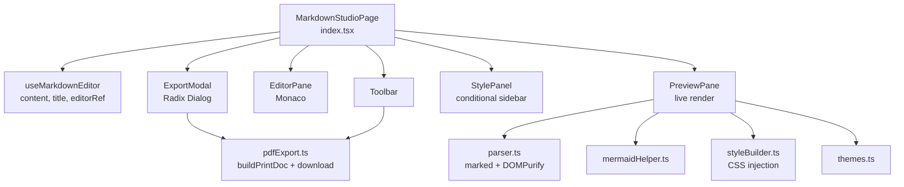
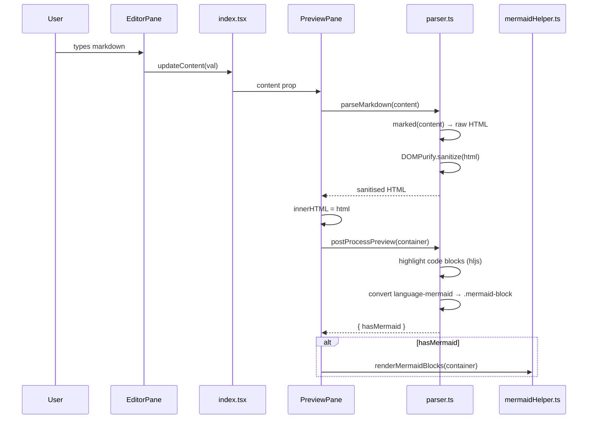
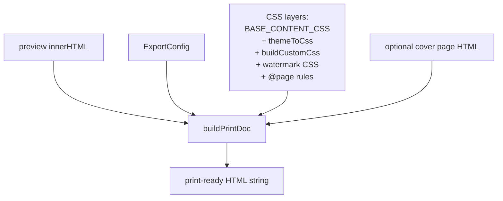
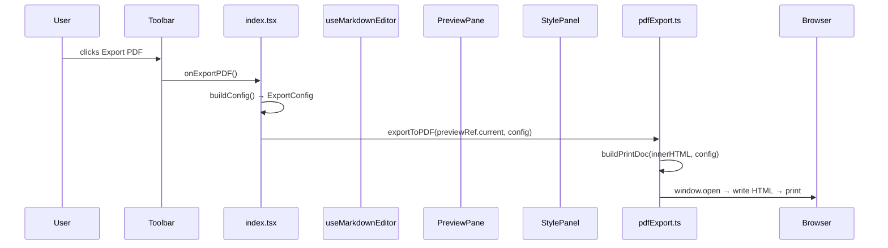

# Markdown Studio

## What It Is

Markdown Studio is a full-featured markdown editor with live preview, a rich design-theme system, custom CSS overrides, mermaid diagram rendering, and export to PDF, HTML, or raw `.md`. The editor is Monaco; the preview injects sanitised HTML into the DOM and layers Google Fonts + theme CSS on top. Export opens a print window with fully self-contained HTML.

---

## File Tree

```
src/features/markdown-studio/
├── index.tsx                    (76)   — Root page, layout, export orchestration
├── hooks/
│   └── useMarkdownEditor.ts     (92)   — Content, title, editor ref, file load
├── components/
│   ├── EditorPane.tsx           (49)   — Monaco wrapper
│   ├── PreviewPane.tsx          (88)   — Live HTML render + theme injection
│   ├── Toolbar.tsx              (97)   — Title, style toggle, export buttons
│   ├── StylePanel.tsx          (297)   — Right sidebar: presets / doc / elements
│   └── ExportModal.tsx         (425)   — Modal: per-export theme/layout config
└── utils/
    ├── parser.ts                (58)   — marked + DOMPurify + hljs + mermaid
    ├── styleBuilder.ts         (187)   — Types, CSS generation, CSS injection helpers
    ├── themes.ts               (146)   — 11 design themes + font URLs
    ├── mermaidHelper.ts         (62)   — Mermaid init + render
    └── pdfExport.ts            (193)   — Print-window HTML builder + download helpers
```

---

## Architecture



---

## How the Preview Works

The preview pipeline runs on every content/theme/style change:



Theme CSS is injected into a `<style id="devhub-preview-theme-css">` tag in `document.head` on every theme/style change — never inline. Google Fonts + Fontshare CDN links are injected once via `<link id="devhub-preview-fonts">`.

The preview always renders light-background (matching PDF output). `BASE_PREVIEW_CSS` forces `color: #24292e`.

---

## Themes (`themes.ts`)

11 predefined themes. Each is a `Theme` object:

```typescript
interface Theme {
  id: string
  label: string
  fontBody: string          // CSS font stack for body
  fontHeading: string       // CSS font stack for headings
  headingFontScope: 'h123' | 'all'
  lineHeight: number
  headingLetterSpacing?: string
  headingTextTransform?: string
  tableThUppercase?: boolean
  blockquoteExtra?: string  // raw CSS (padding, border-radius, etc.)
  colors: {
    h1: string; h2: string; h3: string; h456: string
    blockquoteBorder?: string; blockquoteBg?: string
  }
}
```

| Theme | Fonts | Colour Character |
|-------|-------|-----------------|
| Classic | Playfair Display + DM Sans | Navy blues |
| Professional | Satoshi + Plus Jakarta | Blue, blockquote with bg |
| Modern | Manrope (both) | Blue, minimal |
| Clean Report | Source Serif 4 + Playfair | Indigo, uppercase tables |
| Editorial | Playfair + Source Serif 4 | Warm browns, serif only |
| Slate | DM Sans + Plus Jakarta | Cool neutrals |
| Nordic | DM Sans + Manrope | Blue, light blockquote bg |
| Royal | Playfair Display + DM Sans | Indigo, purple blockquote |
| Sunset | DM Sans + Plus Jakarta | Warm oranges |
| Minimal Mono | JetBrains Mono | Uppercase headings, mono only |
| Emerald | DM Sans + Plus Jakarta | Green tones |

`themeToCss(theme, root)` converts a theme to scoped CSS for `.markdown-preview` (or equivalent root selector). `THEME_ACCENT` maps each theme ID to a hex colour used by the UI (active border, style panel swatch).

---

## Style System (`styleBuilder.ts`)

Three layers of CSS get stacked in the preview:

1. `BASE_PREVIEW_CSS` — hard resets (box-sizing, colour)
2. `themeToCss(theme)` — chosen theme typography
3. `buildCustomCss(settings, root)` — user overrides

### Types

```typescript
interface DocumentSettings {
  fontFamily: string
  color: string
  backgroundColor: string
  borderWidth: string; borderStyle: string; borderColor: string
  borderRadius: string
  padding: string
}

interface ElementRule extends DocumentSettings {
  selector: string
  fontSize: string; fontWeight: string; lineHeight: string
  letterSpacing: string; textTransform: string; margin: string
}

interface StyleSettings {
  document: DocumentSettings
  rules: ElementRule[]
}
```

### CSS generation

`buildDecls(obj)` converts JS property keys to CSS properties:
- Maps `borderWidth` → `border-width`, combines border longhand into `border:` shorthand
- All values are run through `sanitize(value)` which strips `{`, `}`, `;` to prevent injection

`scopeSelector(root, selector)` prepends root to every comma-separated selector in a multi-selector string.

---

## Style Panel (`StylePanel.tsx`)

Three tabs:

**Preset** — Grid of theme cards. Each card shows three colour bars (h1/h2/h3) and a blockquote border accent. Active card gets accent border + raised bg.

**Document** — Controls for `DocumentSettings` fields: font family, text colour, background colour, border (width/style/colour), border radius, padding. Reset button restores defaults.

**Elements** — List of `ElementRule` cards. Each card is a `RuleCard`:
- Collapsed: shows selector preview
- Expanded: quick-select dropdown from `COMMON_SELECTORS` + custom input, full property grid

`COMMON_SELECTORS` contains 17 selectors: h1–h6, p, span, li, a, code, pre, blockquote, table, th, td.

---

## Export System (`pdfExport.ts`)

### `ExportConfig`

```typescript
interface ExportConfig {
  themeId: string
  styleSettings: StyleSettings
  // Cover page:
  coverPage: boolean; coverTitle: string; coverSubtitle: string
  coverAuthor: string; coverDate: string
  // Header:
  showHeader: boolean; headerLeft: string; headerCenter: string; headerRight: string
  // Footer:
  showFooter: boolean; footerPageNumbers: boolean
  // Watermark:
  watermark: string
}
```

### `buildPrintDoc(html, config)`

Produces a complete `<!DOCTYPE html>` string:



Page CSS uses `@page { size: A4; margin: 0 }`. Page numbers come from `@bottom-right { content: counter(page) }`. The watermark is a CSS pseudo-element rotated 45° with low opacity.

### Export functions

| Function | What it does |
|----------|-------------|
| `exportToPDF(previewEl, config)` | `window.open('')` → write print doc → wait for `document.fonts.ready` → `window.print()` |
| `exportToHTML(previewEl, config)` | Same HTML → Blob → download |
| `exportToMarkdown(content, title)` | Raw markdown → `.md` Blob → download |
| `downloadBlob(blob, filename)` | Creates temp object URL → synthetic `<a>` click → revoke |

---

## Hook: `useMarkdownEditor`

```typescript
{
  content: string
  title: string
  setTitle: fn
  updateContent: (val?: string) => void
  loadFile: (content: string, filename: string) => void
  handleEditorMount: OnMount   // wired to Monaco's onMount
}
```

`handleEditorMount` overrides Ctrl+V inside Monaco:
1. Tries `navigator.clipboard.readText()` (requires gesture context)
2. Falls back to `document.execCommand('paste')`
3. Inserts via `editor.executeEdits()`

This is needed because Monaco's built-in paste can fail on clipboard permission in some browser contexts.

---

## Export Modal (`ExportModal.tsx`)

A Radix Dialog (`@radix-ui/react-dialog`) with three tabs (Preset, Style, Layout) that let users configure per-export settings independently of the live editor's style panel. The export config starts from `defaultExportConfig(docTitle)` and is mutated locally within the modal.

The Style tab mirrors `StylePanel` with `ExportRuleCard` sub-components. The Layout tab controls cover page, header, footer, and watermark.

---

## Mermaid Integration (`mermaidHelper.ts`)

Mermaid is initialised with a soft pastel palette designed for light backgrounds:

```
lavender, soft blue, pink background tones
```

`initMermaid(appTheme)` calls `mermaid.initialize({...})` once per app-theme change. Security level is `'antiscript'` (blocks script injection from diagram code).

`renderMermaidBlocks(container)` clears `data-processed` + existing SVGs on existing mermaid blocks, then calls `mermaid.run({ nodes })`. Errors are caught silently — mermaid renders inline error boxes itself.

---

## Data Flow: End-to-End



---

## How to Contribute

### Add a theme

Add a `Theme` object to the `THEMES` array in `themes.ts`. Add its accent colour to `THEME_ACCENT`. The preset tab in `StylePanel` and `ExportModal` picks it up automatically.

### Add a CSS property to the style panel

1. Add the field to `DocumentSettings` (and `ElementRule`) in `styleBuilder.ts`.
2. Add a CSS-property mapping in `buildDecls()`.
3. Add a `PanelField` row in `StylePanel.tsx` (Document tab) and in `ExportRuleCard` in `ExportModal.tsx`.

### Add a file format to export

Create a function following the pattern of `exportToHTML` in `pdfExport.ts`. Call it from `Toolbar.tsx` and wire the button in `index.tsx`.

### Add a mermaid diagram theme

Edit `SOFT_VARS` in `mermaidHelper.ts`. Refer to mermaid's `ThemeVariables` interface for available keys.
