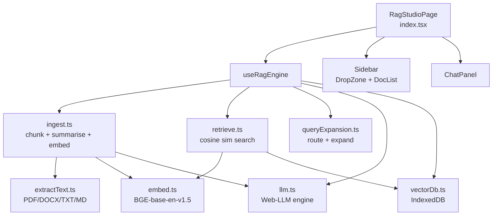
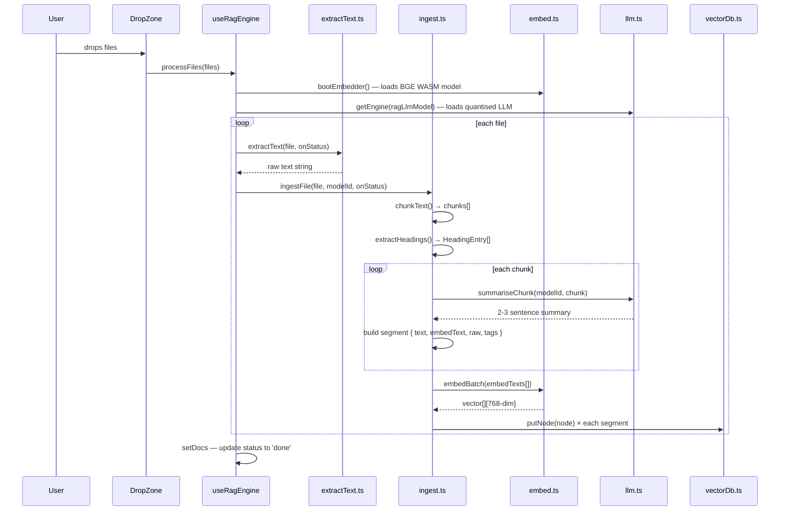
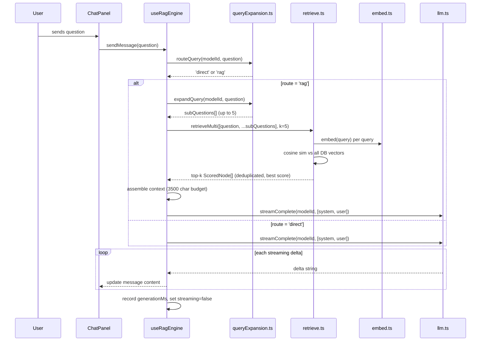

# RAG Studio

## What It Is

RAG Studio is a fully local, browser-based document Q&A system. Upload PDFs, DOCX, TXT, or Markdown files; the studio chunks and embeds them locally using a WASM embedder, persists vectors in IndexedDB, and lets you ask questions answered by a quantised LLM running in the browser via WebGPU/WebAssembly. No server, no API keys, no data leaves the device.

---

## File Tree

```
src/features/rag-studio/
├── index.tsx                    (53)   — Root page, sidebar + chat layout
├── components/
│   ├── ChatPanel.tsx           (151)   — Chat UI + streaming + markdown
│   ├── DocList.tsx              (57)   — Document status list
│   ├── DropZone.tsx             (59)   — Drag-and-drop file upload
│   ├── ModelOverlay.tsx         (29)   — Download progress modal
│   └── RagToolbar.tsx           (22)   — Top toolbar + "Clear all"
├── hooks/
│   └── useRagEngine.ts         (286)   — Core orchestration
└── utils/
    ├── embed.ts                 (45)   — BGE embedder via @xenova/transformers
    ├── extractText.ts           (70)   — PDF / DOCX / TXT / MD extraction
    ├── ingest.ts               (138)   — File → chunks → summaries → embeddings
    ├── llm.ts                   (80)   — Web-LLM engine management
    ├── models.ts                (60)   — 30+ curated model registry
    ├── prompts.ts               (75)   — All system + user prompt templates
    ├── queryExpansion.ts        (61)   — Query routing + sub-question expansion
    ├── retrieve.ts              (71)   — Cosine similarity retrieval
    └── vectorDb.ts              (73)   — IndexedDB persistence
```

---

## Architecture



---

## Full Pipeline

### Upload → Indexing



### Query → Answer



---

## Hook: `useRagEngine`

The single source of truth for the entire studio. Returns:

```typescript
{
  docs: DocEntry[]
  messages: ChatMessage[]
  chatDisabled: boolean
  retrievalStage: RetrievalStage   // 'idle' | 'expanding' | 'retrieving' | 'generating'
  bootEmbedder: () => Promise<void>
  loadPersistedDocs: () => Promise<void>
  processFiles: (files: File[]) => Promise<void>
  sendMessage: (question: string) => Promise<void>
  clearDocs: () => Promise<void>
  removeDoc: (name: string) => Promise<void>
}
```

### `bootEmbedder()`

One-shot. Downloads and caches the BGE-base-en-v1.5 model (~30MB). Sets `embeddingReadyRef.current = true`. Shows overlay progress. Called on page mount.

### `loadPersistedDocs()`

Queries `vectorDb.getSourceFiles()`. Populates `docs` with `status: 'done'` for any previously indexed files. Called on mount — the studio is functional across browser sessions.

### `processFiles(files)`

Loads both embedder and LLM (in parallel if not already loaded). Processes files sequentially with per-file error isolation — a failing file shows an error tile without blocking others.

### `sendMessage(question)`

The RAG pipeline. Key detail: context assembly has a 3500-character budget. Top-k nodes are added until the budget is exhausted. `ragSystemPrompt(contextBlock)` instructs the LLM to answer strictly from context or say "I couldn't find that in uploaded documents."

### `clearDocs()` / `removeDoc(name)`

`clearDocs` wipes all IndexedDB vectors and resets all state. `removeDoc` uses `vectorDb.clearBySource(name)` to delete only vectors for one file.

---

## Utils

### `embed.ts`

Model: `Xenova/bge-base-en-v1.5` — 768-dimensional sentence embeddings, runs in-browser via @xenova/transformers (WASM + ONNX).

```typescript
getEmbedder(onProgress?)              → Promise<FeatureExtractionPipeline>
embed(text: string)                   → Promise<number[]>         // 768-dim
embedBatch(texts[], onProgress?)      → Promise<number[][]>
```

`getEmbedder` is a singleton — model downloads once per session and is cached.

### `extractText.ts`

| Format | Library | Notes |
|--------|---------|-------|
| `.pdf` | `pdfjs-dist` | Page-by-page text layer extraction. Detects line breaks via y-coordinate gaps. Throws if no text layer (scanned PDF). |
| `.docx` | `mammoth` | Extracts raw text, logs conversion warnings |
| `.txt`, `.md` | Native | `file.text()` |

`extractText(file, onStatus)` routes by extension and calls `onStatus` for UI feedback.

### `ingest.ts`

**Chunking:**
- `CHUNK_SIZE = 1500` characters
- `CHUNK_OVERLAP = 150` characters  
- Splits on sentence boundaries (`.!?` + whitespace) or paragraph breaks

**Headings:**
- `extractHeadings(text)` — regex parse of `## Heading` lines → `{ pos, level, text }[]`
- `getTagsForPosition(chunkStart, headings)` — returns breadcrumb trail of parent headings

**Segment format:**
```typescript
{
  text: string        // LLM summary (2-3 sentences)
  embedText: string   // "[Source: file.pdf | Tags: Intro > Concepts]\n{summary}"
  raw: string         // original chunk text
  tags: string[]      // heading breadcrumb
}
```

Each chunk produces at least one segment (summary). If summary differs from raw, both are added as separate segments with different embedText prefixes — this doubles retrieval coverage.

### `llm.ts`

Wraps `@mlc-ai/web-llm` (quantised LLMs in-browser via WebGPU/WASM).

```typescript
getEngine(modelId, onProgress?)        → Promise<MLCEngine>   // singleton per modelId
resetEngine()                          → void
complete(modelId, messages, opts?)     → Promise<string>       // non-streaming
streamComplete(modelId, messages, opts?) → AsyncGenerator<string>  // streaming, yields deltas
```

`getEngine` handles model switching — drops old engine if `modelId` changes. Loading is async; `_loadingPromise` prevents duplicate downloads.

### `models.ts`

Registry of 30+ curated quantised models:

```typescript
interface ModelEntry {
  id: string        // MLC model ID
  label: string     // Display name
  family: string    // e.g., 'Qwen3', 'Llama 3.2'
  sizeLabel: string // '1B', '4B', '7B', etc.
  vramMB: number    // VRAM requirement estimate
}

DEFAULT_MODEL_ID = 'Qwen3-4B-q4f16_1-MLC'  // ~3.4 GB VRAM
```

Families included: Qwen3, Qwen3.5, Llama 3.1/3.2, Phi-4, Phi-3.5, SmolLM2, Gemma, DeepSeek R1, Mistral, Ministral, OLMo 2, Hermes.

### `prompts.ts`

All LLM prompt templates:

| Function | Purpose | Used by |
|----------|---------|---------|
| `bgeQueryPrefix(query)` | BGE retrieval instruction prefix | embed.ts |
| `chunkSummarisationSystemPrompt` | Instruction to summarise chunks | ingest.ts |
| `queryExpansionPrompt(query)` | Generate 5 sub-questions | queryExpansion.ts |
| `contextAwareExpansionPrompt(query, snippet)` | Sub-questions with context | queryExpansion.ts |
| `routingExpansionPrompt(query)` | Classify direct vs RAG | queryExpansion.ts |
| `ragSystemPrompt(contextBlock)` | Answer from docs only | useRagEngine.ts |
| `noDocsSystemPrompt` | Tell user to upload docs | useRagEngine.ts |

### `queryExpansion.ts`

**`routeQuery(modelId, query)`** — Asks LLM to output JSON `{"route":"direct"}` or `{"route":"rag"}`. Falls back to regex if JSON parse fails. Returns `'rag'` if ambiguous.

**`expandQuery(modelId, query)`** — Generates up to 5 sub-questions. `parseQuestions(raw)` cleans the output: strips list markers, filters lines under 10 chars, filters URLs/API paths, requires at least 3 alphabetic chars.

**`expandQueryWithContext`** — Same but primes with a document excerpt for context-aware expansion.

### `retrieve.ts`

**`retrieve(query, k=5)`**:
1. Embed query with `bgeQueryPrefix` wrapper
2. Fetch all nodes from vectorDb
3. Filter by matching vector dimension
4. Compute cosine similarity to all nodes
5. Return top-k sorted descending

**`retrieveMulti(queries[], kPerQuery=5)`**:
- Runs `retrieve` for each query in parallel
- Deduplicates by node ID (keeps highest score if duplicated)
- Returns merged list sorted by score

**`cosineSim(a, b)`**: standard dot-product / (|a| × |b|). Handles zero-norm edge case.

### `vectorDb.ts`

IndexedDB database `"rag-studio-vectors"`, single store `"knowledge_nodes"`.

```typescript
interface KnowledgeNode {
  id?: number          // auto-increment
  text: string         // summary
  rawChunk: string     // original chunk
  sourceFile: string   // filename
  vector: number[]     // 768-dim embedding
  tags?: string[]      // heading breadcrumb
}
```

| Function | What it does |
|----------|-------------|
| `putNode(node)` | Insert, returns ID |
| `getAllNodes()` | Full scan (used for retrieval) |
| `clearAll()` | Wipe store |
| `clearBySource(file)` | Delete by `sourceFile` index |
| `getSourceFiles()` | Unique source file names |
| `countNodes()` | Row count |

Index: `by_source` on `sourceFile` (non-unique) — enables O(n) per-file deletion via cursor.

---

## Components

### `ChatPanel`

Renders message list + input textarea. Messages are right-aligned (user, gray bg) or left-aligned (AI, surface bg, markdown rendered via `parseMarkdown` from markdown-studio).

Streaming AI messages strip `<think>...</think>` blocks (for reasoning models like DeepSeek R1). Shows animated stage label ("Thinking…", "Fetching…", "Generating…") with dots while streaming.

Enter submits (Shift+Enter = newline). Auto-scrolls to latest message.

### `DocList`

Renders status icons per document:
- `Loader2` spinning → processing
- `CheckCircle` green → done
- `XCircle` red → error

Hover reveals delete button (calls `onRemove(name)`). Shows `statusText` during processing, filename when done.

### `DropZone`

Drag-and-drop + click-to-browse. Accepts `.txt`, `.md`, `.pdf`, `.docx`. Filters invalid extensions before calling `onFiles`. Visual drag-over feedback via `dragOver` state.

### `ModelOverlay`

Fixed z-50 overlay shown during model download. Shows label, progress bar (percentage), and optional detail text. Also shows "Models are cached after first download."

---

## Settings Integration

RAG Studio reads from `settingsStore`:
- `ragLlmModel` — which quantised model to use (default: `Qwen3-4B-q4f16_1-MLC`)
- `contextAwareExpansion` — whether to pass a document snippet to the query expander

These are set in the app's global settings panel, not within the studio itself.

---

## How to Contribute

### Add a supported file format

1. Add the extension to `DropZone.tsx`'s accepted list.
2. Add an extractor function in `extractText.ts` following the pattern of `extractDocx`.
3. Add a case in `extractText(file, onStatus)`.

### Add a model to the registry

Add an entry to `CURATED_MODELS` in `models.ts` with its MLC model ID. The ID must be available in the MLC CDN. The settings panel picks it up automatically.

### Change chunk size

Edit `CHUNK_SIZE` and `CHUNK_OVERLAP` in `ingest.ts`. Larger chunks = more context per retrieved node but less precision. Smaller = higher precision but may miss cross-sentence context.

### Add a retrieval strategy

Create a function in `retrieve.ts` following the `retrieve` signature. Wire it in `useRagEngine.ts`'s `sendMessage` method. The vector schema and embedding model don't need to change.

### Tune the query expansion

Edit prompt templates in `prompts.ts`. The parsing logic for raw LLM output is in `parseQuestions()` in `queryExpansion.ts`.
