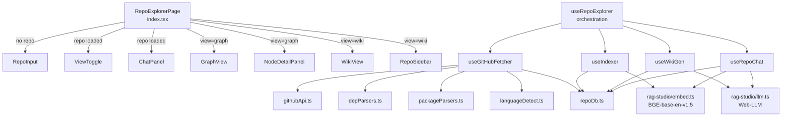
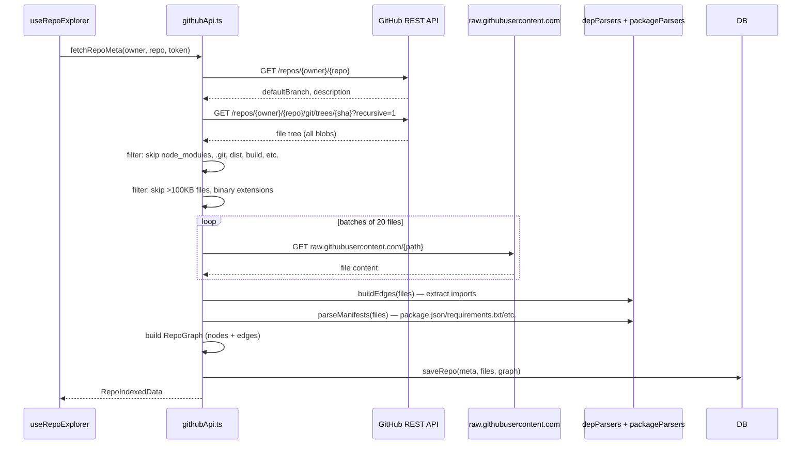
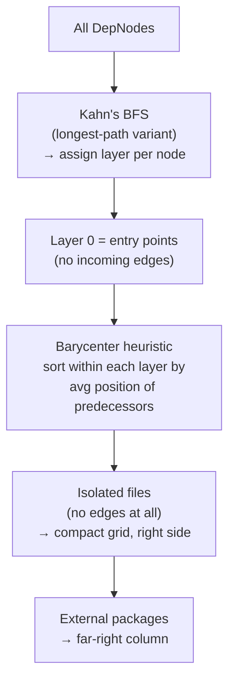
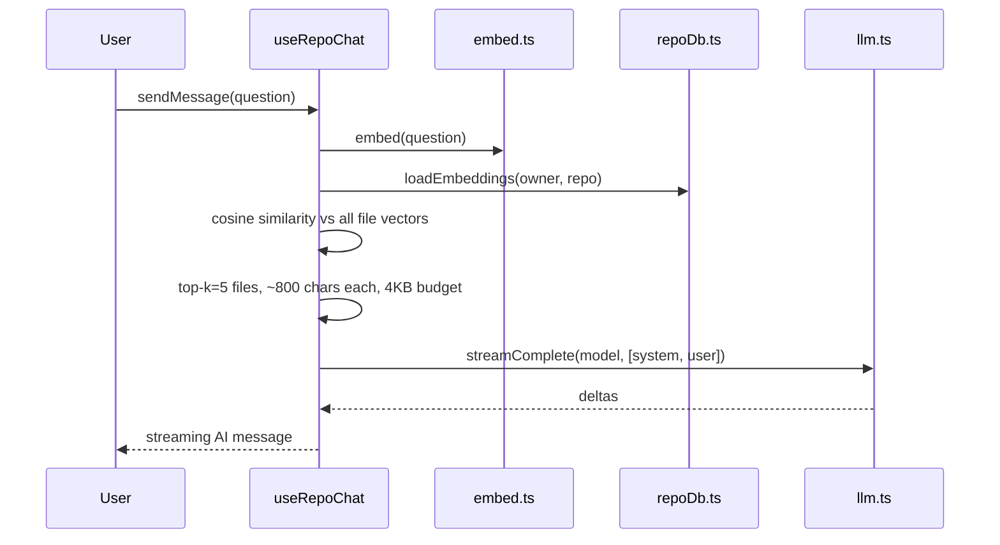
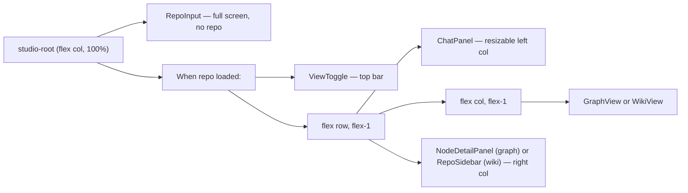

# Repo Explorer

## What It Is

Repo Explorer fetches any public (or token-authenticated private) GitHub repository, parses its dependency graph, embeds every file locally, and lets you explore it three ways: an interactive DAG graph of file dependencies, a wiki view with AI-generated documentation per file, and a semantic RAG chat that answers questions about the codebase. All indexing, embedding, and LLM inference run in-browser and persist in IndexedDB across sessions.

---

## File Tree

```
src/features/repo-explorer/
├── types.ts                     (61)   — All shared types
├── index.tsx                    (90)   — Root page, layout
├── hooks/
│   ├── useRepoExplorer.ts       (98)   — Main orchestration
│   ├── useGitHubFetcher.ts     (127)   — GitHub API fetch + parse
│   ├── useIndexer.ts            (57)   — File embedding
│   ├── useWikiGen.ts           (155)   — LLM wiki generation
│   └── useRepoChat.ts          (117)   — Semantic RAG chat
├── components/
│   ├── RepoInput.tsx            (95)   — URL input form
│   ├── ViewToggle.tsx           (81)   — Toolbar + graph/wiki switch
│   ├── GraphView.tsx           (322)   — ReactFlow DAG graph
│   ├── WikiView.tsx             (42)   — File wiki wrapper
│   ├── NodeDetailPanel.tsx     (140)   — Wiki/code dual-tab panel
│   ├── ChatPanel.tsx           (146)   — Resizable RAG chat
│   ├── RepoSidebar.tsx         (144)   — File tree browser
│   ├── GraphView.css            (38)   — ReactFlow control styles
│   ├── ChatPanel.css            (52)   — Markdown in chat styles
│   └── NodeDetailPanel.css      (11)   — Wiki markdown styles
└── utils/
    ├── repoDb.ts               (130)   — IndexedDB (5 stores)
    ├── githubApi.ts            (129)   — GitHub REST API wrapper
    ├── languageDetect.ts        (72)   — Extension → language + colour
    ├── depParsers.ts           (176)   — Import/require extraction
    └── packageParsers.ts       (122)   — Manifest parsing (npm/pip/cargo/go)
```

---

## Architecture



---

## Data Types

### `RepoFile`

```typescript
interface RepoFile {
  path: string           // e.g. 'src/utils/helpers.ts'
  content: string        // full file text
  language: string       // detected language name
  sizeBytes: number
  skipped?: 'too-large' | 'binary'
}
```

### `DepNode` / `DepEdge`

```typescript
interface DepNode {
  id: string             // path for internals, 'pkg:name' for externals
  label: string
  type: 'internal' | 'external'
  language: string
  color: string          // language colour hex
  path?: string          // internal only
  packageName?: string   // external only
}

interface DepEdge {
  id: string
  source: string         // node id
  target: string         // node id
}
```

### `WikiPage`

```typescript
interface WikiPage {
  path: string
  content: string        // markdown
  generatedAt: number    // timestamp
}
```

---

## Fetch Pipeline (`useGitHubFetcher`)



**Skipped directories:** `node_modules`, `.git`, `dist`, `build`, `vendor`, `__pycache__`, `.vscode`, `coverage`, `.next`, `.nuxt`, `out`, `target`, `.cargo`.

**Skipped files:** Binary extensions (images, archives, executables) detected by `isBinary(path)`. Files over 100KB.

---

## Dependency Graph Construction

### Import extraction (`depParsers.ts`)

`extractImports(content, language)` uses language-specific regexes:

| Language | Patterns extracted |
|----------|--------------------|
| JS/TS | `import x from '…'`, `require('…')`, `import('…')` |
| Python | `import x`, `from x import y` |
| Go | `import "pkg"` and block imports |
| Rust | `use crate::module` |
| Java/Kotlin | `import x.y.z` |
| Ruby | `require '…'` |
| PHP | `require/include`, `use namespace` |
| C/C++ | Local `#include "…"` only |
| Swift/Dart | `import …` |

`resolveRelative(fromPath, specifier, allPaths)` resolves `./` and `../` imports to actual file paths. Tries candidates: bare path, `.ts`, `.tsx`, `.js`, `.jsx`, `/index.*`.

`buildEdges(files)` — for each file, for each import:
- If resolvable locally → internal edge
- If not relative and not resolvable → external package (strip scope prefix, store as `pkg:name`)

### Manifest parsing (`packageParsers.ts`)

| File | Ecosystem |
|------|-----------|
| `package.json` | npm (dependencies + devDependencies + peer) |
| `requirements.txt` | pip |
| `Cargo.toml` | cargo |
| `go.mod` | go |
| `Gemfile` | ruby gems |
| `pyproject.toml` | pip (PEP 621) |

Returns `ExternalPackage[]` — `{ name, version?, ecosystem }` — deduplicated by name.

---

## Graph View (`GraphView.tsx`)

Uses ReactFlow for rendering. The layout algorithm is custom (no dagre/elk dependency).

### Layout algorithm



**Node styling:**
- Internal nodes: language colour at 30% opacity fill, `text-on-surface` border
- Selected node: accent border + drop shadow
- Isolated nodes: muted, 50% opacity

**Features:**
- Toggle external packages visibility (default: hidden)
- Language legend (top 8 languages by file count)
- Node count + edge count display
- Draggable, pan/zoom, minimap

---

## Indexer (`useIndexer.ts`)

Embeds files using the same BGE-base-en-v1.5 model as RAG Studio (shared code from `rag-studio/utils/embed.ts`).

```typescript
// embed text = "File: {path}\n{first 1500 chars of content}"
indexFiles(owner, repo, files): Promise<Map<path, vector[]>>
```

Yields to main thread every 5 files (`await new Promise(r => setTimeout(r, 0))`) to prevent paint stalls during WASM inference. Saves to IndexedDB as `owner/repo::filepath` keys.

`loadIndex(owner, repo)` restores from DB. Returns `false` if no cached embeddings exist.

---

## Wiki Generator (`useWikiGen.ts`)

Generates AI documentation per file on demand (not batch).

**Prompt structure:**
- System: "You are a technical documentation writer. Output ONLY markdown."
- User: "Document this file in 4 sections: Summary, Key Exports, Dependencies, Usage Notes"

**Streaming:**
- Uses `streamComplete()` from `rag-studio/utils/llm.ts`
- State updates on every chunk → live streaming display in `NodeDetailPanel`

**Post-processing:**
- Strips `<think>...</think>` blocks (reasoning model artefacts)
- Cuts content before a second `## Summary` (guards against LLM repetition loop)

**Caching:** Checks in-memory Map first, then IndexedDB. Generated page saved to both.

**Ref optimisation:** `wikiPagesRef` and `generatingRef` are kept in sync with state. The streaming callback closes over refs (not state) to prevent `useCallback` thrashing on every chunk.

---

## Repo Chat (`useRepoChat.ts`)

Semantic search over the indexed file embeddings:



System prompt: "You are a helpful assistant for the `{owner}/{repo}` codebase. Answer based only on the provided files."

---

## Components

### `RepoInput`

URL input + optional GitHub token (password field). Shows user-friendly errors:
- `AUTH_REQUIRED` → "Private repo: add a token"
- `REPO_NOT_FOUND` → "Repo not found or private"

Footer: "Files are indexed locally in your browser."

### `ViewToggle`

Toolbar showing `owner/repo`, default branch, index age ("2h ago"), refetch button, and graph/wiki toggle tabs.

### `GraphView`

ReactFlow graph. Node click calls `onNodeClick(path)` → opens `NodeDetailPanel`. Toggle button hides/shows external package nodes.

### `WikiView`

Thin wrapper — shows "Select a file from the sidebar" placeholder, or delegates to `NodeDetailPanel` when a file is selected.

### `NodeDetailPanel`

Two tabs: **Wiki** and **Code**.

- **Wiki tab**: Shows generated markdown, auto-triggers generation on tab switch if not cached. Live-streams content as LLM outputs. Shows timestamp when done.
- **Code tab**: Monaco read-only editor, auto-detects language for syntax highlighting (`c++` → `cpp`, etc.).

Header: file path. Footer: language + file size.

### `ChatPanel`

Resizable via drag on right edge (MIN=180px, MAX=600px, default=288px). User messages right-aligned (accent bg), AI messages left-aligned (surface bg, markdown via `parseMarkdown`).

`ChatPanel.css` sets custom properties for markdown rendering: smaller fonts, condensed spacing, surface-raised code bg.

### `RepoSidebar`

Right sidebar in wiki view. Builds a nested tree from flat file paths via `buildTree(files)`. Sorts: directories first, then files, alphabetical within each. Directories start expanded to depth 2.

---

## Database (`repoDb.ts`)

Five IndexedDB object stores:

| Store | Key pattern | Contents |
|-------|------------|----------|
| `repo_meta` | `"owner/repo"` | `RepoMeta` |
| `repo_files` | `"owner/repo"` | `RepoFile[]` |
| `repo_graph` | `"owner/repo"` | `RepoGraph` |
| `repo_embeddings` | `"owner/repo"` | `Map<path, vector>` serialised |
| `repo_wiki` | `"owner/repo::filepath"` | `WikiPage` |

`listRepos()` scans `repo_meta` to show cached repos. `deleteRepo(owner, repo)` deletes from all five stores, including wiki pages via prefix key scan.

---

## Language Detection (`languageDetect.ts`)

Pure extension-to-language lookup table. Returns `{ name, color }`. 30+ extensions covered. Unknown → gray.

`isBinary(path)` checks against a `BINARY_EXTS` set (images, archives, executables, fonts, lockfiles). Used during fetch to skip files that can't be text-embedded.

---

## Layout



---

## How to Contribute

### Add a language for import extraction

Add a regex case in `extractImports()` in `depParsers.ts`. Add the language to `LANG_MAP` in `languageDetect.ts` with an extension and colour.

### Add a package manifest format

Add a parser function in `packageParsers.ts`. Add the filename to the dispatch map in `parseManifests()`.

### Change graph layout

The layout algorithm is in `GraphView.tsx` itself (the `buildLayout()` function). Key steps: layering, barycenter sort, isolated grid, external column. Extracting it to `utils/` would be a clean refactor.

### Improve wiki prompts

Edit the system and user prompt strings in `useWikiGen.ts` directly. The prompt format is plain strings — no template library.

### Add a new view mode

1. Add the mode to `ExplorerView` in `types.ts`.
2. Add a toggle button in `ViewToggle.tsx`.
3. Add a conditional render branch in `index.tsx`.
4. Implement the component.
