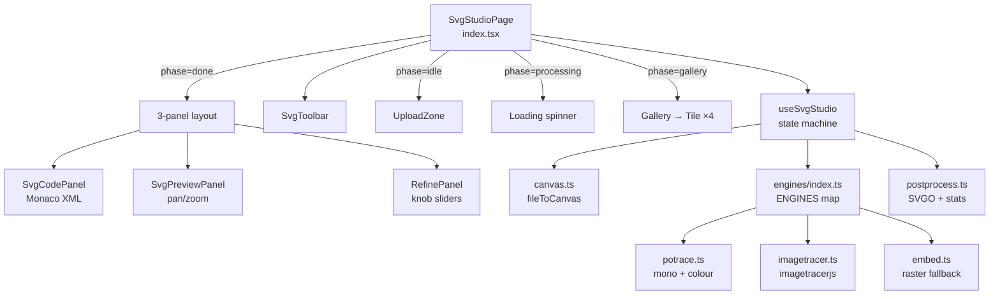
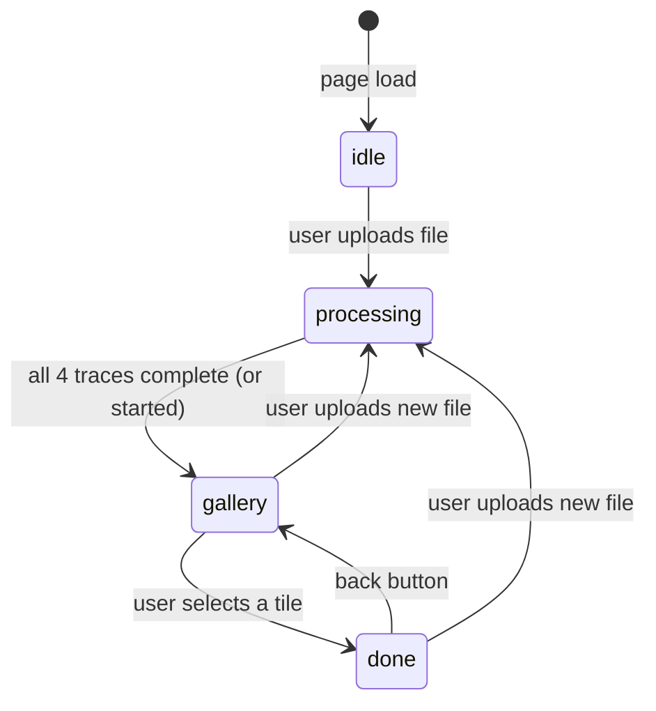
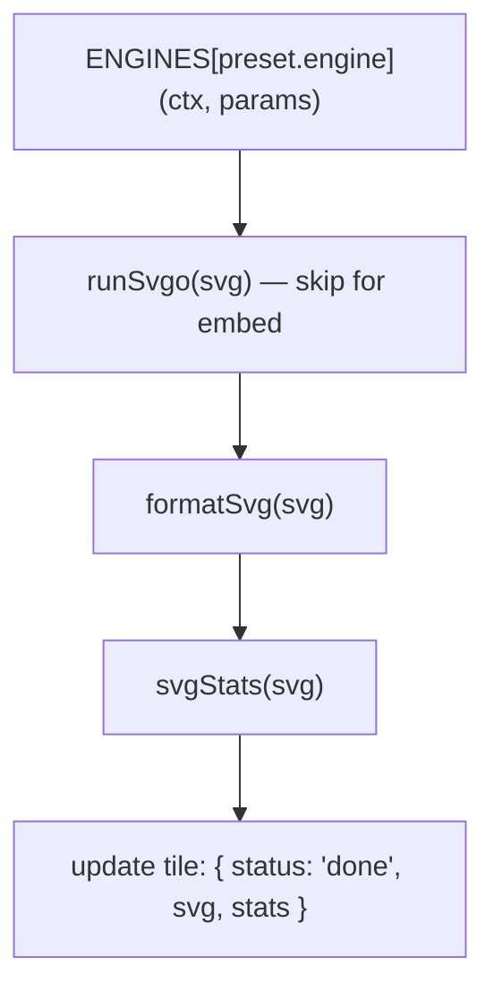
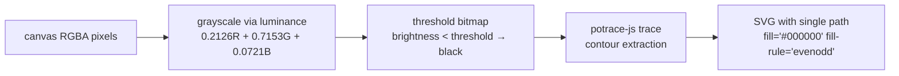
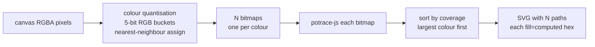
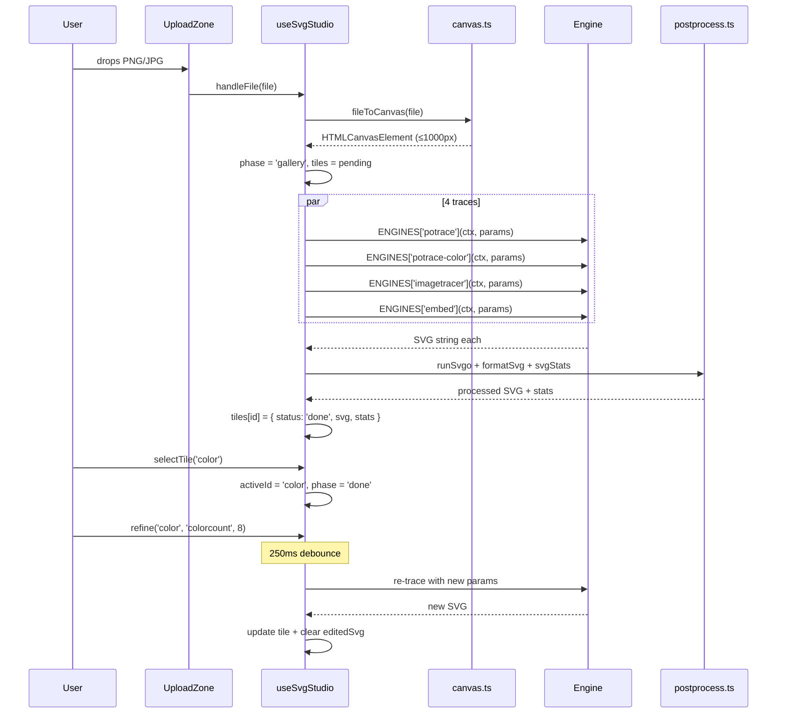

# SVG Studio

## What It Is

SVG Studio converts raster images (PNG/JPG) to SVG using four different tracing engines — monochrome Potrace, colour-layered Potrace, full-colour ImageTracer, and a raster-embed fallback. All four run in parallel when you upload. A gallery lets you pick the best result, then a three-panel editor lets you tune parameters, preview, and edit the SVG code directly.

---

## File Tree

```
src/features/svg-studio/
├── index.tsx                    (83)   — Root page, phase routing, layout
├── hooks/
│   └── useSvgStudio.ts         (193)   — Full state machine + tracing logic
├── engines/
│   ├── types.ts                 (32)   — EngineId, TraceParams, EnginePreset
│   ├── index.ts                 (64)   — PRESETS array + ENGINES map
│   ├── potrace.ts              (129)   — Mono + colour Potrace wrappers
│   ├── imagetracer.ts           (15)   — imagetracerjs dynamic import
│   └── embed.ts                 (22)   — Raster-inside-SVG fallback
├── utils/
│   ├── canvas.ts                (38)   — File → scaled canvas
│   └── postprocess.ts           (76)   — SVGO, format, stats
└── components/
    ├── SvgToolbar.tsx          (103)   — Branding + copy/download/upload
    ├── UploadZone.tsx           (81)   — Drag-and-drop upload
    ├── Gallery.tsx              (38)   — 4-tile preset grid
    ├── Tile.tsx                (103)   — Individual preset card
    ├── SvgCodePanel.tsx         (60)   — Monaco XML editor
    ├── SvgPreviewPanel.tsx     (118)   — Pan/zoom SVG preview
    └── RefinePanel.tsx          (78)   — Knob sliders for tracing params
```

---

## Architecture



---

## Phases



| Phase | What renders |
|-------|-------------|
| `idle` | `UploadZone` (full centred card) |
| `processing` | Spinner + "Preparing tracers" |
| `gallery` | 2×2 `Gallery` grid |
| `done` | Three-panel: code editor + preview + refine |

---

## The Four Engines

| ID | Preset label | Engine | Best for |
|----|-------------|--------|---------|
| `mono` | Mono | `potrace` | Logos, icons, line art (black and white) |
| `color` | Color | `potrace-color` | Flat illustrations, posters (posterised) |
| `detailed` | Detailed | `imagetracer` | Photos, gradients, complex colour images |
| `embed` | Embed | `embed` | Scanned docs, images potrace/IT can't handle |

---

## Hook: `useSvgStudio`

### Exported state

```typescript
{
  phase: Phase                           // idle | processing | gallery | done
  file: File | null
  presets: EnginePreset[]               // The 4 presets
  tiles: Record<string, TileState>      // pending | done | failed per preset
  activeId: string | null              // Selected preset
  activePreset: EnginePreset | null
  params: Record<string, TraceParams>  // Current knob values per preset
  activeSvg: string | null             // editedSvg ?? activeTile.svg
  error: string | null
  refining: boolean
  handleFile(file: File): void
  selectTile(id: string): void
  backToGallery(): void
  editSvg(svg: string): void
  refine(id, knobId, value): void
}
```

### `handleFile(file)`

1. Bumps `runId` ref — any in-flight traces from a previous upload see the new `runId` and discard their results.
2. Sets `phase = 'processing'`.
3. Calls `fileToCanvas(file)` (max 1000px).
4. Sets `phase = 'gallery'`.
5. Resets all tile states to `{ status: 'pending' }`.
6. Launches 4 parallel `runTrace()` calls — one per preset.
7. Each trace resolves independently; tiles update as they finish.

### `runTrace(preset, canvas, file, myRunId)` (internal)



Checks `myRunId === runId.current` before writing state to prevent stale results overwriting a new upload.

### `refine(id, knobId, value)`

1. Updates `params[id][knobId] = value` (and `paramsRef.current`).
2. Clears existing debounce timer for this preset.
3. Sets new 250ms timer → on fire, increments `reqIds[id]`, calls `runTrace`.
4. If the active preset was refined, clears `editedSvg` (so the live SVG re-syncs to the new trace result).

### `editSvg(svg)`

Stores manual edit in `editedSvg` state. `activeSvg = editedSvg ?? activeTile.svg` — manual edit takes precedence until the user refines, which auto-clears it.

---

## Engines

### `potrace.ts` — Mono trace



**Params:** `threshold` (1–254), `turdsize` (suppress speckles), `alphamax` (curve corner smoothness), `opttolerance` (curve optimisation).

### `potrace.ts` — Colour trace



**Params:** `colorcount` (2–8), plus same `turdsize`/`alphamax`/`opttolerance` as mono.

`hex(r, g, b)` converts the quantised colour bucket centroid to a hex string. `pathListToD(pathList)` serialises potrace contour objects to SVG `d` attribute values (Bézier curves + line segments, floats to 2 decimal places).

### `imagetracer.ts` — Full-colour trace

Dynamic imports `imagetracerjs` on first use (not bundled). Passes canvas `ImageData` to `IT.imagedataToSVG(imageData, { viewbox: true, ...params })`. 

**Params:** `numberofcolors` (palette size), `pathomit` (min path length).

### `embed.ts` — Raster fallback

Reads file as a Data URL, wraps it in:
```xml
<svg viewBox="0 0 W H" xmlns="...">
  <image href="data:image/png;base64,..." width="W" height="H"/>
</svg>
```

No params. Returns a Promise (file read is async).

---

## Utils

### `canvas.ts` — File → Canvas

```typescript
const MAX_DIM = 1000

async function fileToCanvas(file: File): Promise<HTMLCanvasElement>
```

1. `URL.createObjectURL(file)` → load ``
2. Scale down if `max(width, height) > MAX_DIM` (maintain aspect ratio)
3. Draw to canvas with `willReadFrequently: true` hint (for repeated `getImageData()`)
4. Revoke object URL

### `postprocess.ts` — SVGO + Stats

```typescript
runSvgo(svg: string): string
// multipass=true, floatPrecision=2, preset-default, removeDimensions
// Returns minified SVG (preserves viewBox; removes width/height for scalability)

formatSvg(svg: string): string
// One element per line, 2-space indent, auto-dedents closing tags

normalizeSvgForDisplay(svg: string): string
// DOMParser → ensure viewBox → remove width/height → serialise

svgStats(svg: string): { bytes, paths, nodes, lines }
// bytes = UTF-8 byte count
// paths = count of <path elements
// nodes = count of path commands (M, L, C, etc.)
// lines = newline count
```

---

## Components

### `SvgToolbar`

```
[SVG Studio] [filename] [preset badge?]   [spacer]   [Back?] [Copy SVG?] [Download?] [Upload]
```

**Copy SVG**: shows "Copied ✓" for 1.8s (manual setTimeout, not `useCopy`). Downloads as `.svg` with the original filename's extension replaced.

### `UploadZone`

Accepts `.png`, `.jpg`, `.jpeg` only. Two states: default (centred card with format badges) and drag-over (accent border, icon change).

### `Gallery` + `Tile`

`Gallery` is a 2-column grid of `Tile` components.

Each `Tile`:
- Shows label + stats (paths, nodes, size) when `status === 'done'`
- Spinner when `pending`, error icon + message when `failed`
- SVG preview via `dangerouslySetInnerHTML` (DOMPurify sanitised, `normalizeSvgForDisplay` applied)
- Hover overlay: "Use this one" / "Selected" (if active)
- 2px dashed border: accent when active, gray otherwise

### `SvgCodePanel`

Monaco editor, language: `xml`, `onChange` bubbles to `editSvg()`. Shows stats (lines, bytes, paths) in header. Theme follows app theme.

### `SvgPreviewPanel`

Pan/zoom preview:
- Zoom: 0.1×–8×, step 1.25×
- Drag to pan
- Zoom/pan reset when SVG prop changes
- Background: 24px-spaced dot grid (inline style, data-driven)
- SVG rendered via `dangerouslySetInnerHTML` (sanitised + normalised)

### `RefinePanel`

Radix Tooltip on each knob label. Range inputs (`<input type="range">`) with `accent-accent` class. `onChange` fires `refine(id, knobId, newValue)`. Shows "no adjustable parameters" for embed preset (empty knobs array).

---

## Engine Presets Reference

```typescript
// Mono
{ id: 'mono', engine: 'potrace', defaults: { threshold: 128, turdsize: 2, alphamax: 1, opttolerance: 0.2 },
  knobs: [threshold (1-254), turdsize (0-20), alphamax (0-1.34), opttolerance (0-1)] }

// Color
{ id: 'color', engine: 'potrace-color', defaults: { colorcount: 5, turdsize: 2, alphamax: 1, opttolerance: 0.2 },
  knobs: [colorcount (2-8), turdsize (0-20), alphamax (0-1.34), opttolerance (0-1)] }

// Detailed
{ id: 'detailed', engine: 'imagetracer', defaults: { numberofcolors: 16, pathomit: 8 },
  knobs: [numberofcolors (2-64), pathomit (0-20)] }

// Embed
{ id: 'embed', engine: 'embed', defaults: {}, knobs: [] }
```

---

## Data Flow: End-to-End



---

## How to Contribute

### Add a tracing engine

1. Add the ID to `EngineId` in `engines/types.ts`.
2. Create `engines/yourengine.ts` exporting a `TraceFn`.
3. Add to `ENGINES` map in `engines/index.ts`.
4. Add a preset to `PRESETS` in `engines/index.ts` with appropriate `knobs`.
5. `useSvgStudio` picks it up automatically.

### Add a knob to an existing preset

Add a `KnobDef` to the preset's `knobs` array in `engines/index.ts`. Add the key to `defaults`. The `RefinePanel` renders all knobs automatically.

### Change SVGO config

Edit the SVGO options object in `runSvgo()` in `postprocess.ts`. Refer to SVGO's plugin documentation for available transforms.

### Support additional input formats

Edit `UploadZone.tsx`'s accepted MIME list and add decoding logic in `imageToCanvas()` in `converters.ts` (currently in image-studio — SVG studio's canvas.ts only decodes via standard ``).
