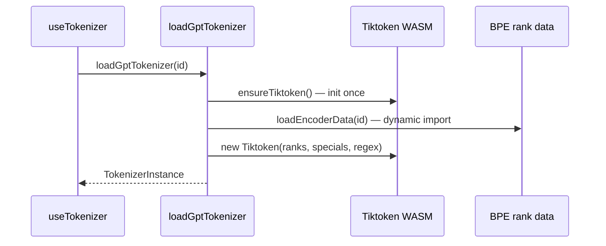
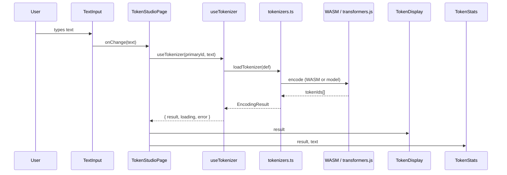

# Token Studio

## What It Is

Token Studio is a browser-based tokenizer playground. Paste or type text and see it broken into tokens in real time — coloured chips, stats, and a side-by-side comparison mode across different LLM tokenizers. Supports three OpenAI/GPT encodings (via WASM Tiktoken) and three local model tokenizers (via @xenova/transformers).

---

## File Tree

```
src/features/token-studio/
├── index.tsx                    (63)   — Root page, layout, mode state
├── hooks/
│   └── useTokenizer.ts          (53)   — Async load + encode hook
├── utils/
│   └── tokenizers.ts           (122)   — Loader, cache, encoder definitions
└── components/
    ├── TextInput.tsx             (27)   — Textarea + char/word count
    ├── TokenDisplay.tsx          (58)   — Coloured token chips
    ├── TokenDisplay.css          (35)   — Chip colours + hover (oklch)
    ├── TokenStats.tsx            (34)   — Token count / unique / ratio
    ├── TokenizerSelector.tsx     (43)   — <select> grouped by family
    └── ComparePanel.tsx          (82)   — Dual-pane side-by-side view
```

---

## Architecture

```mermaid
graph TD
    Page[TokenStudioPage<br/>index.tsx]
    TInput[TextInput]
    TS[TokenStats]
    TD[TokenDisplay]
    TSel[TokenizerSelector]
    CP[ComparePanel]
    Hook[useTokenizer]
    Utils[tokenizers.ts<br/>loadTokenizer / cache]
    Tiktoken[Tiktoken WASM<br/>cl100k / o200k / p50k]
    Xenova[@xenova/transformers<br/>Qwen / Phi / Llama]

    Page --> TInput
    Page -->|compareMode=false| TS
    Page -->|compareMode=false| TD
    Page -->|compareMode=false| TSel
    Page -->|compareMode=true| CP

    CP -->|useTokenizer x2| Hook
    TD -->|result| Hook
    TS -->|result| Hook

    Hook --> Utils
    Utils -->|family=gpt| Tiktoken
    Utils -->|family=local| Xenova
```

---

## Supported Tokenizers

| ID | Label | Family | Notes |
|----|-------|--------|-------|
| `cl100k_base` | GPT-3.5 / GPT-4 | gpt | Default |
| `o200k_base` | GPT-4o | gpt | Larger vocab |
| `p50k_base` | Codex | gpt | Legacy |
| `Qwen/Qwen2.5-0.5B` | Qwen 2.5 | local | Downloaded on first use |
| `microsoft/Phi-3.5-mini-instruct` | Phi-3.5 | local | |
| `meta-llama/Llama-3.2-1B` | Llama 3 | local | |

---

## Components

### `TokenStudioPage` (`index.tsx`)

Root component. Owns three pieces of state:

| State | Type | Default | Purpose |
|-------|------|---------|---------|
| `text` | `string` | `''` | Raw input |
| `primaryId` | `string` | `'cl100k_base'` | Active tokenizer |
| `compareId` | `string` | `'o200k_base'` | Second pane tokenizer |
| `compareMode` | `boolean` | `false` | Toggle dual-pane |

Layout:
```
Toolbar  [Title] [TokenizerSelector?] [Compare button]
Body     [TextInput]
         if compareMode → ComparePanel
         else           → TokenStats + TokenDisplay
```

### `TextInput`

Simple textarea (8 rows, spellcheck off, monospace). Shows char count + word count below the box. Fires `onChange` on every keystroke.

### `TokenDisplay`

Maps `EncodingResult.tokenTexts` to coloured chips. Each chip's colour is `TOKEN_COLORS[tokenId % 6]` — defined in `TokenDisplay.css` as `color-mix(in oklch, ...)` at 18% opacity. Hovering shows the numeric token ID in a tooltip.

Renders three states: loading spinner, error box, or chip grid.

### `TokenStats`

Shows three metrics computed from `EncodingResult`:

- **Tokens** — `tokenIds.length` (accent-coloured, large)
- **Unique** — `new Set(tokenIds).size`
- **Chars/Token** — `charCount / tokenCount` to 1 decimal

Returns `null` if result is empty.

### `TokenizerSelector`

`<select>` with two `<optgroup>` sections (OpenAI / GPT and Local Models). Reads from `TOKENIZER_DEFS`. Calls `onChange(id)` on selection.

### `ComparePanel`

Calls `useTokenizer` twice (once per side). Renders two `ComparePane` children side-by-side separated by a 1px vertical divider. Each pane has its own `TokenizerSelector`, `TokenStats`, and `TokenDisplay`.

---

## Hook: `useTokenizer`

```typescript
function useTokenizer(tokenizerId: string, text: string): {
  result: EncodingResult | null
  loading: boolean
  error: string | null
}
```

On every change to `tokenizerId` or `text`:

1. If `text` is empty → clear state immediately.
2. Set `loading = true`, clear error.
3. Call `loadTokenizer(def)` (async).
4. On success → set `result`.
5. On error → set `error`.

Uses a `cancelRef` boolean to discard stale results when a new encode starts before the old one finishes.

---

## Utils: `tokenizers.ts`

### Types

```typescript
type TokenizerFamily = 'gpt' | 'local'

interface TokenizerDef {
  id: string
  label: string
  family: TokenizerFamily
  description: string
}

interface EncodingResult {
  tokenIds: number[]
  tokenTexts: string[]   // parallel array — tokenTexts[i] is the text for tokenIds[i]
}

interface TokenizerInstance {
  encodeWithText(text: string): EncodingResult
}
```

### `loadTokenizer(def)`

Main public entry point. Checks `instanceCache` (a `Map`) first. Routes to `loadGptTokenizer` or `loadLocalTokenizer` by `def.family`. Caches the resolved instance so each tokenizer loads only once per browser session.

### GPT path: `loadGptTokenizer(id)`



`encodeWithText` uses `enc.encode_ordinary(text)` then maps each ID back to bytes via `enc.decode_single_token_bytes(id)` + `TextDecoder`.

### Local path: `loadLocalTokenizer(modelId)`

Dynamically imports `@xenova/transformers`, calls `AutoTokenizer.from_pretrained(modelId)`. The model is downloaded and cached by the transformers.js library. `encodeWithText` calls `tokenizer.encode(text)` then decodes each ID individually.

---

## Data Flow



---

## Styling

- Chip colours live in `TokenDisplay.css` using `color-mix(in oklch, <color>, transparent 82%)`. Six colours cycle by `tokenId % 6`.
- `TokenDisplay.css` is the only companion CSS file. Everything else uses Tailwind.
- `TokenizerSelector` and `ComparePanel` use a `SELECT_CLS` constant for consistent dropdown styling.

---

## Key Patterns

| Pattern | Where | Why |
|---------|-------|-----|
| Singleton cache via `Map` | `tokenizers.ts` | Tokenizers are expensive to load; only load once |
| `cancelRef` in useEffect | `useTokenizer.ts` | Prevent stale async results from overwriting newer state |
| Dynamic import for WASM/model | `tokenizers.ts` | Keep main bundle small; load on demand |
| `TOKEN_COLORS[id % 6]` | `TokenDisplay.tsx` | Deterministic colour per token ID across renders |
| Dual `useTokenizer` calls | `ComparePanel.tsx` | Each pane is independent; no shared state |

---

## How to Contribute

### Add a tokenizer

1. Add an entry to `TOKENIZER_DEFS` in `tokenizers.ts` with the correct `family`.
2. For `gpt` family: ensure the encoding ID is supported by `loadEncoderData`. Add a `case` if needed.
3. For `local` family: ensure the Hugging Face model ID is publicly accessible via `AutoTokenizer.from_pretrained`.
4. The selector, hook, and compare panel all pick it up automatically.

### Add a stat

Add the calculation to `TokenStats.tsx`. The `result` object has `tokenIds` and `tokenTexts`; the parent passes raw `text`.

### Change chip colours

Edit the `.token-color-N` rules in `TokenDisplay.css`. Keep to oklch for perceptual uniformity.
