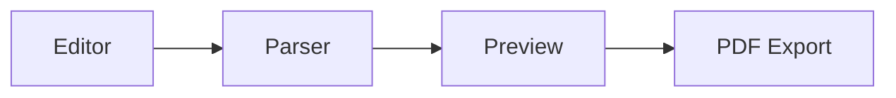

# Slide Deck Export (PPTX-style landscape PDF)

## Goal

Let a user generate a markdown "deck" with an external LLM agent (Claude Code, ChatGPT, etc. — guided by a DevHub-provided skill + template), import it into Markdown Studio, preview it as a paginated slide deck, and export it as a landscape PDF that visually resembles a PowerPoint export. DevHub does not call an LLM itself — it only defines the markdown convention, parses it, and renders/exports it.

## Non-goals (v1)

- No real `.pptx` file export — PDF only.
- No slide transitions/animations.
- No in-app LLM call / generate button.
- No JSON-schema validation of yaml slot contents — malformed/missing fields degrade gracefully (see Error Handling).

## Markdown convention

- `---` alone on a line is the **slide separator**. Splitting on it happens on the raw source string, before any chunk reaches `marked` — so it never collides with normal markdown's own horizontal-rule rendering (each chunk is parsed independently and never contains a raw `---` line itself). The split is **fence-aware**: it tracks whether the scan is inside a ` ``` ` code block and ignores `---` lines while inside one, so a slide containing a code/mermaid block with a literal `---`-looking line doesn't fracture the deck.
- A slide chunk may open with a fenced ` ```yaml ... ``` ` block holding per-slide config. This is used instead of `---`-delimited frontmatter specifically because frontmatter's own `---` fences would be shredded by the slide-separator split. A fenced code block has no such collision and is a convention LLMs reliably reproduce.
- No separate deck-level frontmatter concept. The first slide, with `type: title`, carries deck title/subtitle/author/date — same mechanism as every other slide, one convention instead of two.
- Three fields are universal (valid on any `type`, applied at the slide-wrapper level, not layout-specific):
  - `notes` — speaker notes; shown in editor/preview only, stripped from PDF export.
  - `footer` — per-slide override of the deck's footer (from `ExportConfig`). Flat, 2 levels deep: `footer.show`, `footer.left`, `footer.center`, `footer.right`, `footer.pageNumber`. Any key omitted inherits the deck-level `ExportConfig` value for that slide; `footer.show: false` hides the footer on just that slide (e.g. the title slide).
  - `style` — per-slide style overrides, nested exactly 3 levels: `style.<category>.<property>`. Three fixed categories in v1: `background` (`color`, `image`), `title` (`color`, `fontSize`, `align`), `body` (`color`, `fontSize`). Unknown categories/properties are ignored, not errors (same forward-compatible fallback philosophy as `type`). Values are applied as scoped inline CSS custom properties on that slide's wrapper — this is data-driven per-slide styling coming from parsed yaml, the sanctioned inline-style exception in `CLAUDE.md`'s Tailwind-first rule, not a violation of it.
    - **Value guardrails** (defense-in-depth — the LLM-generated yaml is untrusted input even though it's local-only): each property is validated against an allow-pattern before use; a value that fails is ignored and the deck-level/layout default applies, same silent-fallback philosophy as unknown keys.
      - `color` (`background.color`, `title.color`, `body.color`) — must match hex (`#fff`, `#ffffff`) or `rgb()`/`rgba()`, else ignored.
      - `fontSize` (`title.fontSize`, `body.fontSize`) — must match `^\d+(\.\d+)?(px|em|rem|pt)$` AND resolve within a clamped range (e.g. 8–120px equivalent) — prevents a runaway value from single-handedly blowing out the fixed-size slide box, tying directly into Overflow handling below.
      - `align` (`title.align`) — enum only: `left | center | right`, else ignored.
      - `background.image` — must be an `http(s)://` URL, else ignored (blocks `javascript:`/`data:` schemes).
      - Implementation guardrail: these values are set via a React `style={{ ... }}` object (key/value pairs), never via string-concatenated CSS or `dangerouslySetInnerHTML` — React's attribute escaping is what actually forecloses CSS/HTML injection; the regex/enum checks above are a second layer on top, not a substitute.
- If a chunk has no yaml fence, or `type` is missing/unrecognized, it falls back to `type: content` with the entire chunk body as freeform content. Old plain-markdown decks or slides an LLM got "wrong" never hard-fail.

### Worked example

A full deck exercising every v1 type, the universal `style`/`footer`/`notes` fields, and common body content (list, table, image, mermaid):

````
---
```yaml
type: title
title: "DevHub Architecture"
subtitle: "Q3 Review"
author: "Aayush Gour"
date: "2026-07-14"
footer:
  show: false
style:
  background:
    color: "#0f172a"
  title:
    color: "#ffffff"
    fontSize: "44px"
    align: "center"
```
---
```yaml
type: section
title: "Pipeline Overview"
style:
  background:
    color: "#1e293b"
  title:
    color: "#ffffff"
```
---
```yaml
type: content
title: "What Ships This Quarter"
```
- Slide Deck export (this doc)
- Mermaid theming pass
- Graph mode edge labels
---
```yaml
type: content
title: "Release Comparison"
footer:
  right: "Internal use only"
```
| Version | Date | Notes |
|---|---|---|
| 0.0.8 | 2026-05 | zoom/pan |
| 0.0.9 | 2026-06 | edge labels |
| 0.0.10 | 2026-06 | layout fixes |
---
```yaml
type: two-column
title: "Build vs Buy"
columns:
  - "### Build\n- Full control\n- Slower\n- Owns the roadmap"
  - "### Buy\n| Vendor | Cost |\n|---|---|\n| A | $$ |\n| B | $ |"
```
---
```yaml
type: image-focus
title: "New Preview Layout"
image: "https://example.com/screenshots/preview.png"
caption: "Landscape preview cards, one per slide"
style:
  body:
    fontSize: "18px"
```
Side notes render here as optional body text next to the image.
---
```yaml
type: content
title: "Pipeline"
notes: "Mention this reuses the exact same mermaid pipeline as continuous-mode docs."
```

---
````

Notes on the patterns above:
- **Lists** and **tables** need no special handling — plain markdown in a `content` slide's body (or inside a `two-column` column string), run through the existing `parseMarkdown`/`marked` pipeline unchanged.
- **Images**: `content`/`two-column` slides can embed `` inline like today; `image-focus` is for when the image should anchor the whole slide (dedicated `image` slot, large layout treatment) rather than sit inline in a paragraph.
- **Mermaid** works exactly as it does in continuous-mode docs — a ` ```mermaid ` fenced block in the slide body, picked up by the existing `postProcessPreview`/`renderMermaidBlocks` functions unchanged.
- **`footer`** on the title slide above hides the deck footer for that slide only (`show: false`); the "Release Comparison" slide overrides just `right` and inherits `left`/`center`/`pageNumber` from the deck-level `ExportConfig`.
- **`style`** shows all 3 nesting levels in use (`style` → `title` → `fontSize`) plus a `background` override on the title and section slides — a common PPTX pattern (divider/title slides get a distinct background from content slides).

## v1 slide types

Registry-based — `SLIDE_LAYOUTS: Record<SlideType, SlideLayout>`. Adding a new type later is a new registry entry only; it never requires changes to the split/extract logic. This is the extensibility point for future, more complex layouts (the long-run goal of closer PPTX fidelity).

| type | yaml slots | body markdown use |
|---|---|---|
| `title` | `title, subtitle, author, date` | unused |
| `section` | `title` | unused |
| `content` (default/fallback) | `title` (optional) | full body, incl. mermaid — existing `parseMarkdown`/mermaid pipeline unchanged |
| `two-column` | `title`, `columns: [md, md]` (exactly 2 markdown strings) | unused |
| `image-focus` | `title`, `image` (url), `caption` (optional) | optional side-text body |

Each slot value that is markdown (body, `columns[]`, `caption`) is run through the existing `parseMarkdown` function — layouts never parse markdown themselves, they only arrange already-rendered HTML fragments into a CSS grid. This keeps the parser dumb and layout code purely presentational, so a future complex layout only touches CSS/slot-wiring, never the markdown pipeline.

## Architecture / data flow

```
raw markdown (deck)
  → splitSlides(raw): SlideChunk[]           (split on standalone `---` lines)
  → extractSlideConfig(chunk): SlideConfig    (pull leading ```yaml fence via yaml.parse, rest = body)
  → SLIDE_LAYOUTS[config.type ?? 'content'].render(config, parseMarkdown(slots))
  → stacked .slide-page elements (preview) OR paginated print doc (export)
  → measure + scale-to-fit / clip overflow (see Overflow handling)      (both preview and export)
```

- `splitSlides` / `extractSlideConfig` live in `markdown-studio/utils/slideParser.ts` (new file), separate from `parser.ts`'s continuous-doc path — the two modes don't share document-level frontmatter handling (`splitFrontmatter` in `parser.ts` is untouched, deck mode never calls it).
- `yaml` package is already a dependency (`web/package.json`) — no new dependency needed.

## UI

- **Toolbar**: new "Slide Deck" toggle in Markdown Studio (explicit opt-in, not auto-detected from `---` count — avoids false-positives on docs that use `---` as a normal divider).
- **PreviewPane**: when toggled on, renders a vertical stack of fixed-aspect-ratio landscape cards (one per slide, `aspect-ratio` box, small page-number badge) instead of the current continuous scroll.
- **ExportModal**: new "Slide Deck (PDF)" export option alongside existing PDF/HTML. Existing cover-page toggle is superseded by the `title` slide in this mode (cover-page config hidden when Slide Deck export is chosen); header/footer/watermark options remain available as-is.

## Overflow handling

A slide is a fixed-size box (13.333in × 7.5in in export; matching aspect-ratio card in preview). Long lists/tables/two-column content can exceed it. Rather than silently clip or let content spill past the page in the printed PDF:

- After a slide renders, measure its content's natural (unscaled) height against the box height.
- If content overflows, apply `transform: scale(f)` to the slide's content wrapper, where `f = boxHeight / contentHeight` — shrinks the whole slide proportionally (text, spacing, images together) rather than reflowing/truncating text.
- Scale is floored (e.g. `0.6`) — below that, further shrinking makes text unreadable, so scaling stops and the overflow badge (next bullet) is the signal to fix the source instead of shipping a squint-to-read slide.
- At the floor, remaining overflow clips at the box bounds (`overflow: hidden`) — visible truncation, not a growing page. A small "content overflows" badge renders on that slide in the **preview** only (dev-facing signal so the user trims source markdown); the badge itself is omitted from the export output, same as `notes`.
- One measurement/scale implementation, reused by both the preview stack and the export print doc — the print doc renders the same slide DOM before `window.print()`, so there's no separate overflow logic to keep in sync.

## Export

Reuses `pdfExport.ts`'s existing `window.open` + `window.print()` mechanism — same mechanism as today, per the original ask. Changes for slide-deck mode:
- `@page` becomes `size: 13.333in 7.5in` (true PPTX 16:9 slide dimensions, not generic A4-landscape) with `margin: 0`.
- Every rendered `.slide-page` gets `page-break-after: always`, sized to fill the page exactly.
- `notes` fields are omitted from the exported HTML entirely (never reach the print doc).
- Per-slide `footer` merges over the deck-level `ExportConfig` footer settings for that page only; per-slide `style` is emitted as inline CSS custom properties scoped to that page's wrapper, layered on top of the deck theme/custom CSS the same way document-level style overrides already layer in `pdfExport.ts`.
- Overflow scaling (see Overflow handling above) runs on the rendered DOM before `window.print()` fires, so the printed page reflects the same scale-to-fit/clip result as the preview.

## Error handling

- Chunk with no yaml fence → `type: content`, whole chunk is body.
- `type` present but unrecognized → same fallback to `content` (forward-compatible: a deck authored against a future v2 type set still renders sanely in an older DevHub build).
- `columns` present but not exactly 2 entries on `two-column` → pad/truncate to 2, missing column renders empty rather than throwing.
- Malformed yaml in the fence (`yaml.parse` throws) → caught, chunk falls back to `content` with the raw fence text included in body (visible-but-harmless, not silently dropped) so the user can see something went wrong instead of the slide vanishing.
- `style` with an unknown category/property (e.g. `style.foo.bar`, or a 4th nesting level) → that key is ignored, rest of `style` still applies. `style` present but not an object → whole field ignored, slide renders with deck defaults.
- `footer` with an unknown key → ignored; `footer` present but not an object → whole field ignored, slide inherits deck-level footer.
- `style` value failing its allow-pattern (bad color, unparsable/out-of-range `fontSize`, non-enum `align`, non-http(s) `background.image`) → that single value ignored, rest of `style` still applies (same per-key granularity as unknown categories/properties).
- Content taller than the fixed slide box → scale-to-fit down to the floor, then clip; never grows the page or pushes into the next slide (see Overflow handling).

## Testing

- Unit tests for `splitSlides`/`extractSlideConfig`: a `---`-looking line inside a fenced code block (e.g. a mermaid block) must NOT be treated as a slide break — covered by the fence-aware scan described above.
- Fallback behavior: missing type, unrecognized type, malformed yaml, wrong-length `columns`.
- `style` value validation: each guardrail (bad color, bad/out-of-range `fontSize`, non-enum `align`, non-http(s) `background.image`) rejected individually, rest of `style` unaffected.
- Overflow: a slide with content taller than the box scales down proportionally and stops at the floor scale; content still overflowing at the floor clips rather than pushing page height — snapshot test at floor-scale and at a size just below it.
- Snapshot/visual check per layout type at 13.333in×7.5in.
- Existing continuous-mode markdown export (non-slide) must be unaffected — regression check on `parser.ts`/`pdfExport.ts`'s current A4 path.

## Skill / template deliverable

New docs, outside the app itself:
- `docs/skills/slide-deck-markdown/SKILL.md` — the airtight contract: separator rule, yaml-fence rule (not `---`-frontmatter), full per-type schema, universal fields, fallback behavior, one worked full-deck example. Must spell out the `style` guardrails as hard authoring rules, not just parser trivia — permitted `color`/`fontSize`/`align`/`background.image` formats and ranges, and that content should be kept short enough to fit a slide rather than relying on overflow scale-to-fit (scaling is a safety net, not a layout strategy) — so LLM-authored decks land inside the guardrails on the first try instead of tripping the fallback.
- `docs/skills/slide-deck-markdown/template.md` — a ready-to-copy sample deck exercising all 5 v1 types.
