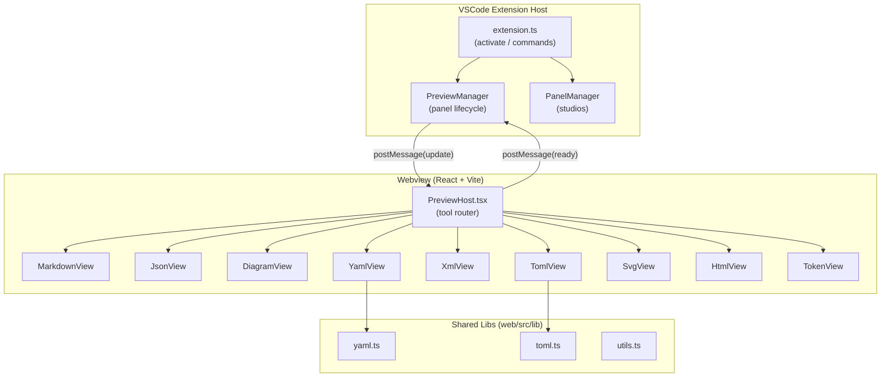

# DevHub Extension — Markdown Fixture

## Table of Contents

1. [Typography](#typography)
2. [Code](#code)
3. [Tables](#tables)
4. [Task Lists](#task-lists)
5. [Blockquotes & Alerts](#blockquotes--alerts)
6. [Math & Diagrams](#math--diagrams)

---

## Typography

**Bold**, _italic_, ~~strikethrough~~, `inline code`, and **_bold italic_**.

> "Any fool can write code that a computer can understand. Good programmers write code that humans can understand."
> — Martin Fowler

This paragraph has a hard line break  
right here (two trailing spaces).

Horizontal rule below:

---

## Code

### JavaScript

```js
async function fetchUser(id) {
  const res = await fetch(`/api/users/${id}`)
  if (!res.ok) throw new Error(`HTTP ${res.status}`)
  return res.json()
}
```

### Rust

```rust
fn fibonacci(n: u64) -> u64 {
    match n {
        0 => 0,
        1 => 1,
        _ => fibonacci(n - 1) + fibonacci(n - 2),
    }
}
```

### Shell

```bash
find . -name "*.ts" -not -path "*/node_modules/*" \
  | xargs grep -l "TODO" \
  | sort
```

---

## Tables

| Language   | Paradigm          | Typing     | GC   | Year |
|------------|-------------------|------------|------|------|
| Rust       | Systems           | Static     | No   | 2015 |
| TypeScript | Multi-paradigm    | Static     | Yes  | 2012 |
| Haskell    | Functional        | Static     | Yes  | 1990 |
| Python     | Multi-paradigm    | Dynamic    | Yes  | 1991 |
| Go         | Concurrent        | Static     | Yes  | 2009 |
| Zig        | Systems           | Static     | No   | 2016 |

Right-aligned numbers:

| Metric         |    Value |
|:---------------|---------:|
| Requests/sec   |  142,000 |
| p50 latency    |    1.2ms |
| p99 latency    |   18.4ms |
| Error rate     |   0.003% |

---

## Task Lists

- [x] Add Markdown preview
- [x] Add JSON tree view
- [x] Add Mermaid diagram support
- [x] Add YAML / XML / TOML parsers
- [ ] Add CSV table view
- [ ] Add JWT decoder studio
- [ ] Add Regex tester
- [ ] Dark/light theme toggle

---

## Blockquotes & Alerts

> **Note**
> This is a standard blockquote used for notes.

> **Warning**
> Nested blockquotes ahead.
>
> > Level 2 — be careful here.
> >
> > > Level 3 — you are deep now.

---

## Lists

### Unordered (nested)

- Frontend
  - React
    - Hooks
    - Server Components
  - Vue
  - Svelte
- Backend
  - Node.js
  - Go
  - Rust (Axum)
- DevOps
  - Docker
  - Kubernetes
  - Terraform

### Ordered

1. Clone the repo
2. Install deps
   1. `npm install` in `web/`
   2. `npm install` in `extension/`
3. Build
4. Run tests
5. Package

---

## Inline HTML

<details>
<summary>Click to expand hidden content</summary>

This content is hidden by default. It uses raw HTML inside Markdown.

```json
{ "secret": true }
```

</details>

---

## Images & Links

[DevHub on GitHub](https://github.com/AayushGour/devhub) — main repository.


---

## Footnotes

Here is a claim that needs a citation.[^1]

Another claim with a longer footnote.[^longnote]

[^1]: Short footnote text.
[^longnote]: This footnote has multiple paragraphs.

    Second paragraph of the footnote.

---
## Mermaid


---

## Unicode & Emoji

Languages: 日本語, 中文, العربية, हिन्दी, Ελληνικά, Русский

Math: α β γ δ ε ζ η θ ι κ λ μ ν ξ π ρ σ τ υ φ χ ψ ω

Symbols: ← → ↑ ↓ ↔ ⇐ ⇒ ∞ ∑ ∏ ∫ √ ≤ ≥ ≠ ≈ ∈ ∉ ⊂ ⊃

Emoji: 🚀 🦀 🐍 💎 🔥 ✅ ❌ ⚠️ 🔒 📦
